<h1>
  <a href="#"></a>
</h1>

<p>
  <a href="https://github.com/google-deepmind/mujoco_menagerie/actions/workflows/build.yml?query=branch%3Amain" alt="GitHub Actions">
    
  </a>
  <a href="https://mujoco.readthedocs.io/en/latest/models.html" alt="Documentation">
    
  </a>
  <a href="https://github.com/google-deepmind/mujoco_menagerie/blob/main/CONTRIBUTING.md">
    
  </a>
</p>

**Menagerie** is a collection of high-quality models for the
[MuJoCo](https://github.com/google-deepmind/mujoco) physics engine, curated by
Google DeepMind.

A physics simulator is only as good as the model it is simulating, and in a
powerful simulator like MuJoCo with many modeling options, it is easy to create
"bad" models which do not behave as expected. The goal of this collection is to
provide the community with a curated library of well-designed models that work
well right out of the gate.

### Gallery

|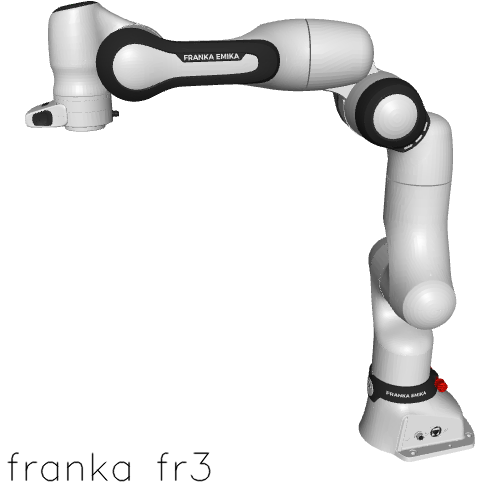|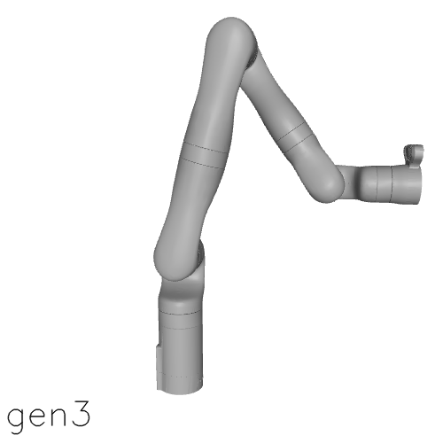|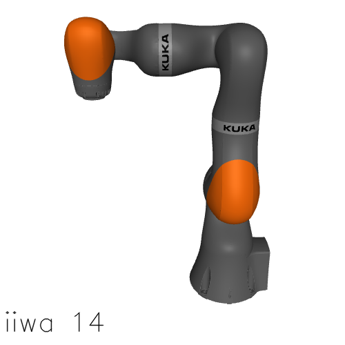|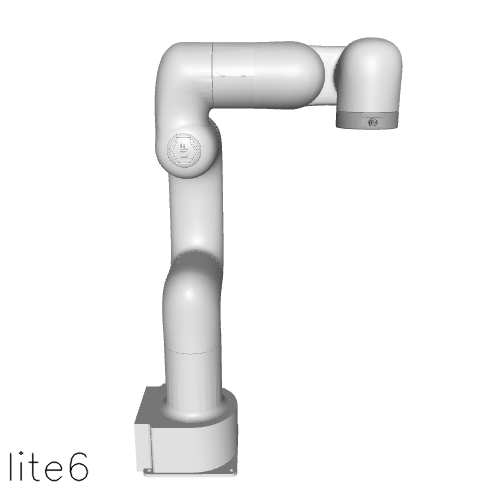|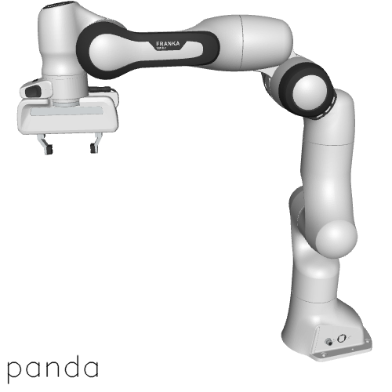|
| :---: | :---: | :---: | :---: | :---: |
|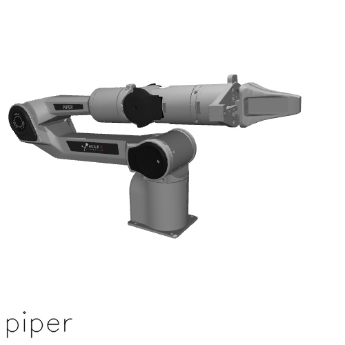|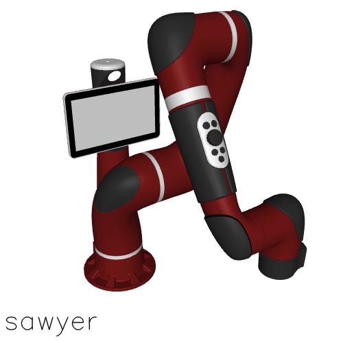|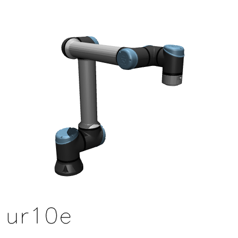|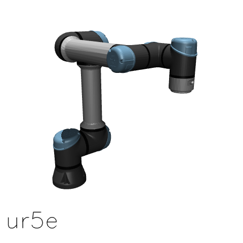|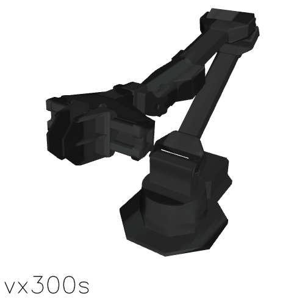|
|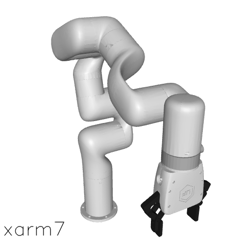|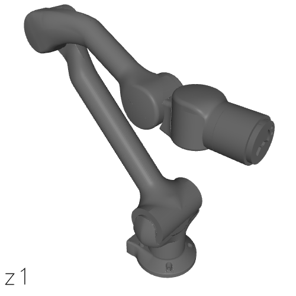|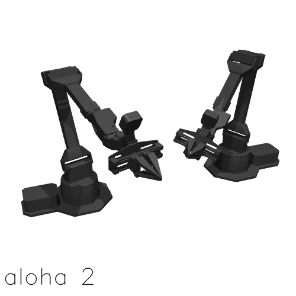|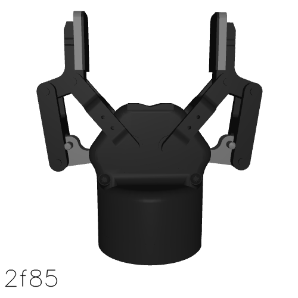|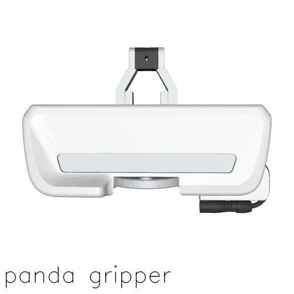|
|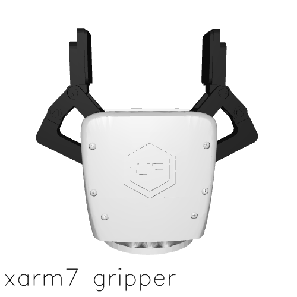|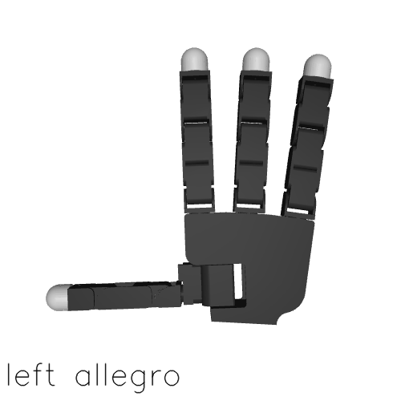|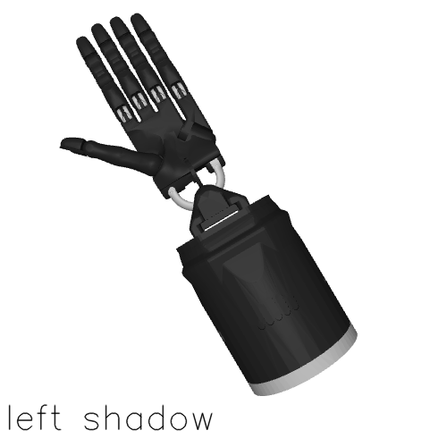|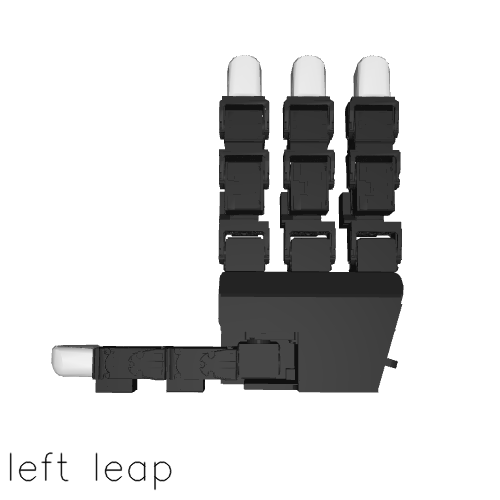|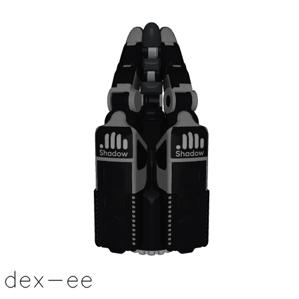|
|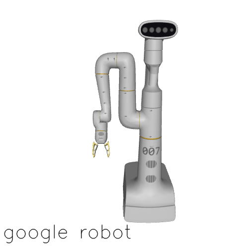|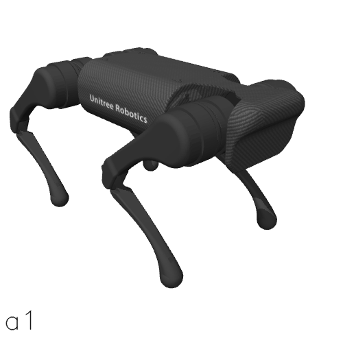|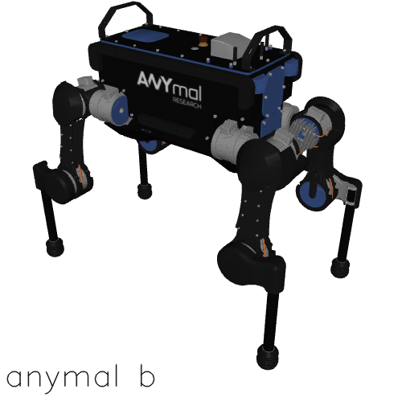|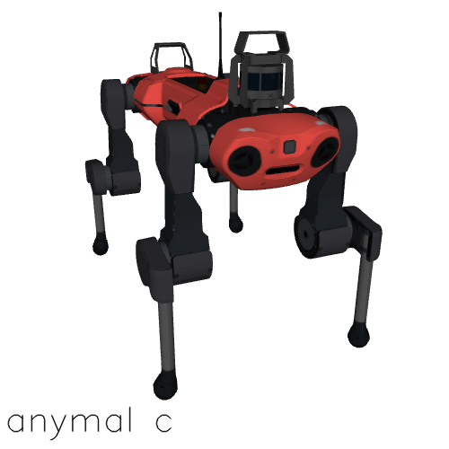|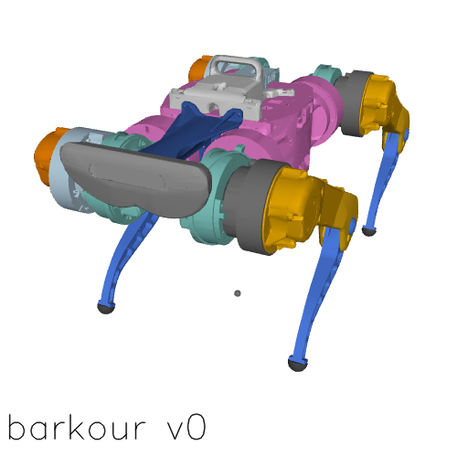|
|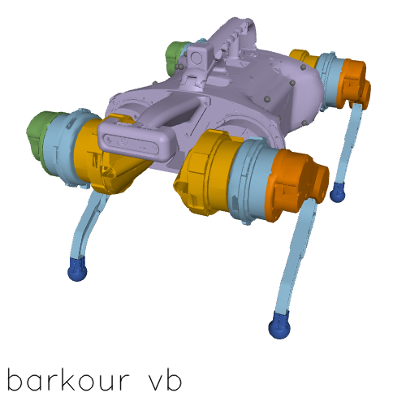|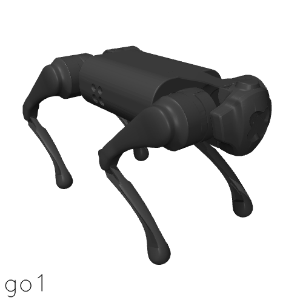|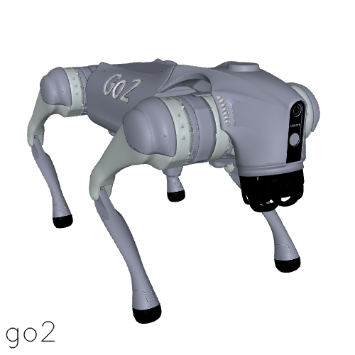|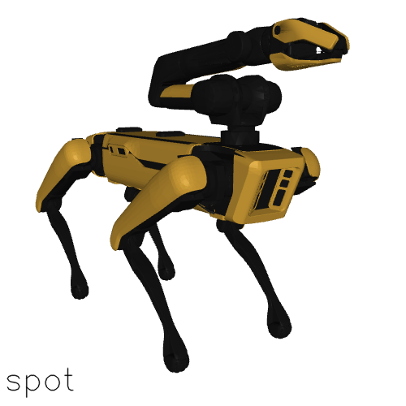|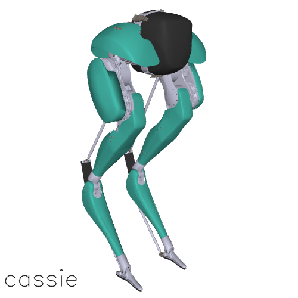|
|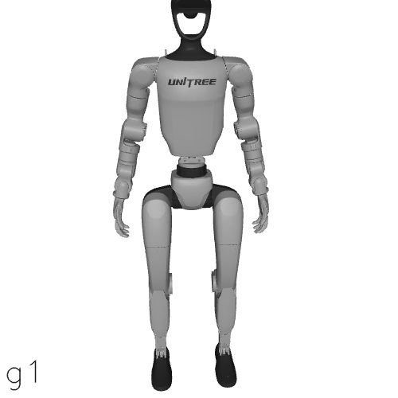|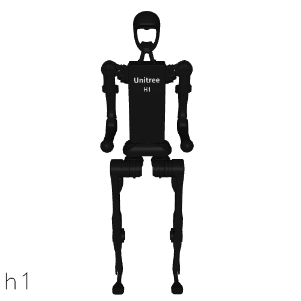|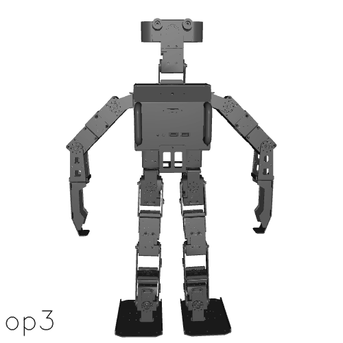|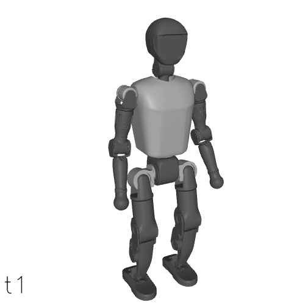|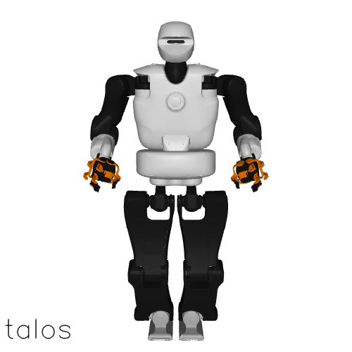|
|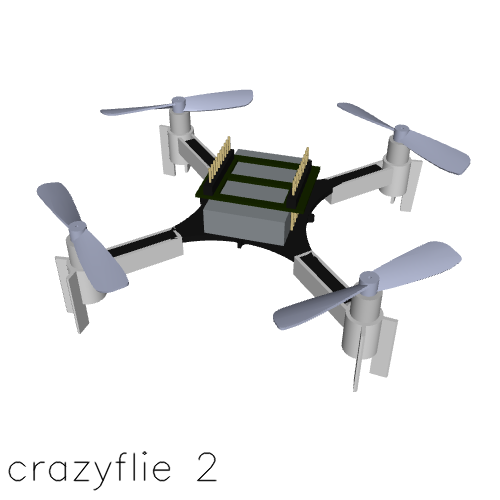|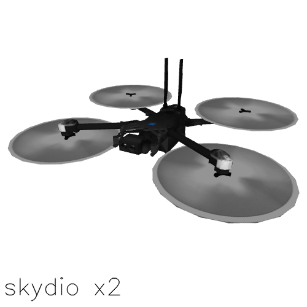|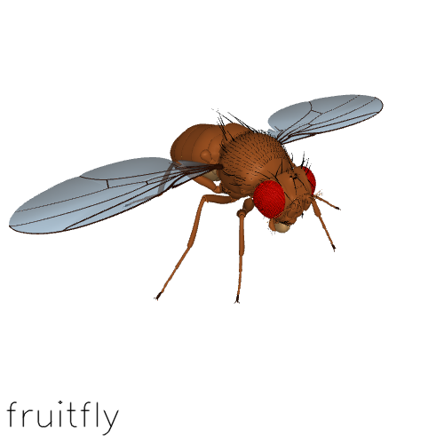|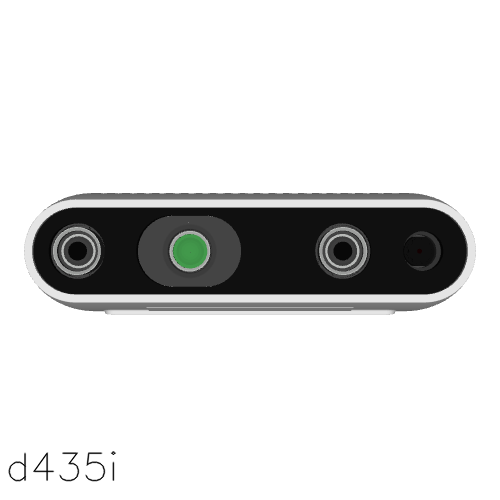||

- [Getting Started](#getting-started)
  - [Prerequisites](#prerequisites)
  - [Overview](#overview)
  - [Usage](#usage)
    - [Via `robot-descriptions`](#via-robot-descriptions)
    - [Via `git clone`](#via-git-clone)
- [Model Quality and Contributing](#model-quality-and-contributing)
- [Menagerie Models](#menagerie-models)
- [Citing Menagerie](#citing-menagerie)
- [Acknowledgments](#acknowledgments)
- [Changelog](#changelog)
- [License and Disclaimer](#license-and-disclaimer)

## Getting Started

### Prerequisites

The minimum required MuJoCo version for each model is specified in its
respective README. You can download prebuilt binaries for MuJoCo from the GitHub
[releases page](https://github.com/google-deepmind/mujoco/releases/), or if you
are working with Python, you can install the native bindings from
[PyPI](https://pypi.org/project/mujoco/) via `pip install mujoco`. For
alternative installation instructions, see
[here](https://github.com/google-deepmind/mujoco#installation).

### Overview

The structure of Menagerie is illustrated below. For brevity, we have only
included one model directory since all others follow the exact same pattern.

```bash
├── unitree_go2
│   ├── assets
│   │   ├── base_0.obj
│   │   ├── ...
│   ├── go2.png
│   ├── go2.xml
│   ├── LICENSE
│   ├── README.md
│   └── scene.xml
│   └── go2_mjx.xml
│   └── scene_mjx.xml
```

- `assets`: stores the 3D meshes (.stl or .obj) of the model used for visual and
  collision purposes
- `LICENSE`: describes the copyright and licensing terms of the model
- `README.md`: contains detailed steps describing how the model's MJCF XML file
  was generated
- `<model>.xml`: contains the MJCF definition of the model
- `scene.xml`: includes `<model>.xml` with a plane, a light source and
  potentially other objects
- `<model>.png`: a PNG image of `scene.xml`
- `<model>_mjx.xml`: contains an MJX-compatible version of the model. Not all
  models have an MJX variant (see [Menagerie Models](#menagerie-models) for more
  information).
- `scene_mjx.xml`: same as `scene.xml` but loads the MJX variant

Note that `<model>.xml` solely describes the model, i.e., no other entity is
defined in the kinematic tree. We leave additional body definitions for the
`scene.xml` file, as can be seen in the Shadow Hand
[`scene.xml`](shadow_hand/scene_right.xml).

### Usage

#### Via `robot-descriptions`

You can use the opensource
[`robot_descriptions`](https://github.com/robot-descriptions/robot_descriptions.py)
package to load any model in Menagerie. It is available on PyPI and can be
installed via `pip install robot_descriptions`.

Once installed, you can load a model of your choice as follows:

```python
import mujoco

# Loading a specific model description as an imported module.
from robot_descriptions import panda_mj_description
model = mujoco.MjModel.from_xml_path(panda_mj_description.MJCF_PATH)

# Directly loading an instance of MjModel.
from robot_descriptions.loaders.mujoco import load_robot_description
model = load_robot_description("panda_mj_description")

# Loading a variant of the model, e.g. panda without a gripper.
model = load_robot_description("panda_mj_description", variant="panda_nohand")
```

#### Via `git clone`

You can also directly clone this repository in the directory of your choice:

```bash
git clone https://github.com/google-deepmind/mujoco_menagerie.git
```

You can then interactively explore the model using the Python viewer:

```bash
python -m mujoco.viewer --mjcf mujoco_menagerie/unitree_go2/scene.xml
```

If you have further questions, please check out our [FAQ](FAQ.md).

## Model Quality and Contributing

Our goal is to eventually make all Menagerie models as faithful as possible to
the real system they are being modeled after. Improving model quality is an
ongoing effort, and the current state of many models is not necessarily
as good as it could be.

However, by releasing Menagerie in its current state, we hope to consolidate
and increase visibility for community contributions. To help Menagerie users
set proper expectations around the quality of each model, we introduce the
following grading system:

| Grade | Description                                                 |
|-------|-------------------------------------------------------------|
| A+    | Values are the product of proper system identification      |
| A     | Values are realistic, but have not been properly identified |
| B     | Stable, but some values are unrealistic                     |
| C     | Conditionally stable, can be significantly improved         |

The grading system will be applied to each model once a proper system
identification toolbox is created. We are currently planning to release
this toolbox later this year.

For more information regarding contributions, for example to add a new model to
Menagerie, see [CONTRIBUTING](CONTRIBUTING.md).

## Menagerie Models

**Arms.**

| Name | Maker | DoFs    | License | MJX |
|------|-------|---------|---------|-----|
| ARX L5 | ARX Robotics | 7 | [BSD-3-Clause](arx_l5/LICENSE) |✖️|
| PiPER | AgileX | 7 | [MIT](agilex_piper/LICENSE) |✖️|
| FR3 | Franka Robotics | 7 | [Apache-2.0](franka_fr3/LICENSE) |✖️|
| iiwa14 | KUKA | 7 | [BSD-3-Clause](kuka_iiwa_14/LICENSE) |✖️|
| Lite6 | UFACTORY | 6 | [BSD-3-Clause](ufactory_lite6/LICENSE) |✖️|
| Panda | Franka Robotics | 7 | [BSD-3-Clause](franka_emika_panda/LICENSE) |✔️|
| Sawyer | Rethink Robotics | 7 | [Apache-2.0](rethink_robotics_sawyer/LICENSE) |✖️|
| Unitree Z1 | Unitree Robotics | 6 | [BSD-3-Clause](unitree_z1/LICENSE) |✖️|
| UR5e | Universal Robots | 6 | [BSD-3-Clause](universal_robots_ur5e/LICENSE) |✖️|
| UR10e | Universal Robots | 6 | [BSD-3-Clause](universal_robots_ur10e/LICENSE) |✖️|
| ViperX 300 | Trossen Robotics | 8 | [BSD-3-Clause](trossen_vx300s/LICENSE) |✖️|
| WidowX 250 | Trossen Robotics | 8 | [BSD-3-Clause](trossen_wx250s/LICENSE) |✖️|
| xarm7 | UFACTORY | 7 | [BSD-3-Clause](ufactory_xarm7/LICENSE) |✖️|
| Gen3 | Kinova Robotics | 7 | [BSD-3-Clause](kinova_gen3/LICENSE) |✖️|
| SO-ARM100 | The Robot Studio | 5 | [Apache-2.0](trs_so_arm100/LICENSE) |✖️|
| Koch v1.1 Low-Cost Robot | Hugging Face | 5 | [Apache-2.0](low_cost_robot_arm/LICENSE) |✖️|
| YAM | I2RT Robotics | 7 | [MIT](i2rt_yam/LICENSE) |✖️|

**Bipeds.**

| Name | Maker | DoFs    | License | MJX |
|------|-------|---------|---------|-----|
| Cassie | Agility Robotics | 28 | [BSD-3-Clause](agility_cassie/LICENSE) |✖️|

**Dual Arms.**

| Name | Maker | DoFs    | License | MJX |
|------|-------|---------|---------|-----|
| ALOHA 2 | Trossen Robotics, Google DeepMind | 16 | [BSD-3-Clause](aloha/LICENSE) |✔️|

**Drones.**

| Name | Maker | DoFs    | License | MJX |
|------|-------|---------|---------|-----|
| Crazyflie 2 | Bitcraze | 0 | [MIT](bitcraze_crazyflie_2/LICENSE) |✖️|
| Skydio X2 | Skydio | 0 | [Apache-2.0](skydio_x2/LICENSE) |✖️|

**End-effectors.**

| Name | Maker | DoFs    | License | MJX |
|------|-------|---------|---------|-----|
| Allegro Hand V3 | Wonik Robotics | 16 | [BSD-2-Clause](wonik_allegro/LICENSE) |✖️|
| UMI Gripper | Stanford University | 1 | [MIT](umi_gripper/LICENSE) |✖️|
| LEAP Hand | Carnegie Mellon University | 16 | [MIT](leap_hand/LICENSE) |✖️|
| Robotiq 2F-85 | Robotiq | 8 | [BSD-2-Clause](robotiq_2f85/LICENSE) |✖️|
| Shadow Hand EM35 | Shadow Robot Company | 24 | [Apache-2.0](shadow_hand/LICENSE) |✖️|
| Shadow DEX-EE Hand | Shadow Robot Company | 12 | [Apache-2.0](shadow_dexee/LICENSE) |✖️|

**Mobile Manipulators.**

| Name | Maker | DoFs    | License | MJX |
|------|-------|---------|---------|-----|
| Google Robot | Google DeepMind | 9 | [Apache-2.0](google_robot/LICENSE) |✖️|
| Stanford TidyBot | Stanford University | 11 | [MIT](stanford_tidybot/LICENSE) |✖️|
| Stretch 2 | Hello Robot | 17 | [Clear BSD](hello_robot_stretch/LICENSE) |✖️|
| Stretch 3 | Hello Robot | 17 | [Apache-2.0](hello_robot_stretch_3/LICENSE) |✖️|
| PAL Tiago | PAL Robotics | 12 | [Apache-2.0](pal_tiago/LICENSE) |✖️|
| PAL Tiago Dual | PAL Robotics | 21 | [Apache-2.0](pal_tiago_dual/LICENSE) |✖️|

**Mobile Bases.**

| Name | Maker | DoFs    | License | MJX |
|------|-------|---------|---------|-----|
| Omniwheel Soccer Robot | Robot Soccer Kit | 4 | [MIT](robot_soccer_kit/LICENSE) |✖️|

**Humanoids.**

| Name | Maker | DoFs    | License | MJX |
|------|-------|---------|---------|-----|
| Adam Lite | PNDbotics | 25 | [MIT](pndbotics_adam_lite/LICENSE) |✖️|
| Apptronik Apollo | Apptronik | 32 | [Apache-2.0](apptronik_apollo/LICENSE) |✔️|
| Berkeley Humanoid | Hybrid Robotics | 12 | [BSD-3-Clause](berkeley_humanoid/LICENSE) |✖️|
| Booster T1 | Booster Robotics | 23 | [Apache-2.0](booster_t1/LICENSE) |✖️|
| Fourier N1 | Fourier Robotics | 30 | [Apache-2.0](fourier_n1/LICENSE) |✖️|
| Robotis OP3 | Robotis | 20 | [Apache-2.0](robotis_op3/LICENSE) |✖️|
| TALOS | PAL Robotics | 32 | [Apache-2.0](pal_talos/LICENSE) |✖️|
| Unitree G1 | Unitree Robotics | 37 | [BSD-3-Clause](unitree_g1/LICENSE) |✔️|
| Unitree H1 | Unitree Robotics | 19 | [BSD-3-Clause](unitree_h1/LICENSE) |✖️|

**Quadrupeds.**

| Name | Maker | DoFs    | License | MJX |
|------|-------|---------|---------|-----|
| ANYmal B | ANYbotics | 12 | [BSD-3-Clause](anybotics_anymal_b/LICENSE) |✖️|
| ANYmal C | ANYbotics | 12 | [BSD-3-Clause](anybotics_anymal_c/LICENSE) |✔️|
| Spot | Boston Dynamics | 12 | [BSD-3-Clause](boston_dynamics_spot/LICENSE) |✖️|
| Unitree A1 | Unitree Robotics | 12 | [BSD-3-Clause](unitree_a1/LICENSE) |✖️|
| Unitree Go1 | Unitree Robotics | 12 | [BSD-3-Clause](unitree_go1/LICENSE) |✖️|
| Unitree Go2 | Unitree Robotics | 12 | [BSD-3-Clause](unitree_go2/LICENSE) |✔️|
| Google Barkour v0 | Google DeepMind | 12 | [Apache-2.0](google_barkour_v0/LICENSE) |✔️|
| Google Barkour vB | Google DeepMind | 12 | [Apache-2.0](google_barkour_vb/LICENSE) |✔️|

**Biomechanical.**

| Name | Maker | DoFs    | License | MJX |
|------|-------|---------|---------|-----|
| IIT Softfoot | IIT Softbots | 92 | [BSD-3-Clause](iit_softfoot/LICENSE) |✖️|
| flybody | Google DeepMind, HHMI Janelia Research Campus | 102 | [Apache-2.0](flybody/LICENSE) |✖️|

**Miscellaneous.**

| Name | Maker | DoFs    | License | MJX |
|------|-------|---------|---------|-----|
| D435i | Intel Realsense | 0 | [Apache-2.0](realsense_d435i/LICENSE) |✖️|

## Citing Menagerie

If you use Menagerie in your work, please use the following citation:

```bibtex
@software{menagerie2022github,
  author = {Zakka, Kevin and Tassa, Yuval and {MuJoCo Menagerie Contributors}},
  title = {{MuJoCo Menagerie: A collection of high-quality simulation models for MuJoCo}},
  url = {http://github.com/google-deepmind/mujoco_menagerie},
  year = {2022},
}
```

## Acknowledgments

The models in this repository are based on third-party models designed by many talented people, and would not have been possible without their generous open-source contributions. We would like to acknowledge all the designers and engineers who made MuJoCo Menagerie possible.

We'd like to thank Pedro Vergani for his help with visuals and design.

The main effort required to make this repository publicly available was undertaken by [Kevin Zakka](https://kzakka.com/), with help from the Robotics Simulation team at Google DeepMind.

This project has also benefited from contributions by members of the broader community — see the [CONTRIBUTORS.md](./CONTRIBUTORS.md) for a full list.

## Changelog

For a summary of key updates across the repository, see the [global CHANGELOG.md](./CHANGELOG.md).

Each individual model also includes its own `CHANGELOG.md` file with model-specific updates, linked directly from the corresponding README.

## License and Disclaimer

XML and asset files in each individual model directory of this repository are
subject to different license terms. Please consult the `LICENSE` files under
each specific model subdirectory for the relevant license and copyright
information.

All other content is Copyright 2022 DeepMind Technologies Limited and licensed
under the Apache License, Version 2.0. A copy of this license is provided in the
top-level LICENSE file in this repository.
You can also obtain it from https://www.apache.org/licenses/LICENSE-2.0.

This is not an officially supported Google product.
