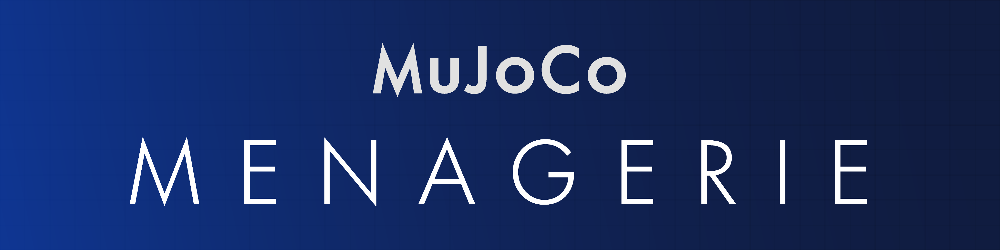
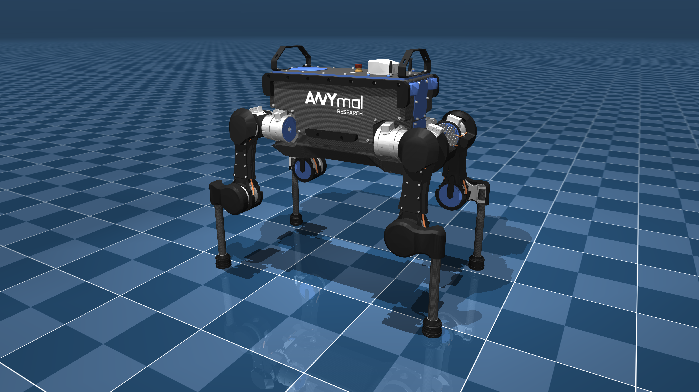

<h1>
  <a href="#"></a>
</h1>

<p>
  <a href="https://github.com/deepmind/mujoco_menagerie/actions/workflows/build.yml?query=branch%3Amain" alt="GitHub Actions">
    
  </a>
  <a href="https://mujoco.readthedocs.io/en/latest/models.html" alt="Documentation">
    
  </a>
  <a href="https://github.com/deepmind/mujoco_menagerie/blob/main/CONTRIBUTING.md">
    
  </a>
</p>

**Menagerie** is a collection of high-quality models for the [MuJoCo](https://mujoco.org/) physics engine, curated by DeepMind.

A physics simulator is only as good as the model it is simulating, and in a powerful simulator like MuJoCo with many modeling options, it is easy to create "bad" models which do not behave as expected. The goal of this collection is to provide the community with a curated library of well-designed models that work well right out of the gate.

- [Getting Started](#getting-started)
    - [Prerequisites](#prerequisites)
    - [Overview](#overview)
    - [Installation and Usage](#installation-and-usage)
- [Model Quality and Contributing](#model-quality-and-contributing)
- [Menagerie Models](#menagerie-models)
- [Citing Menagerie](#citing-menagerie)
- [Acknowledgments](#acknowledgments)
- [License and Disclaimer](#license-and-disclaimer)

## Getting Started

### Prerequisites

Menagerie's only requirement is MuJoCo version 2.2.2 or higher. You can download prebuilt binaries from the GitHub [releases page](https://github.com/deepmind/mujoco/releases/), or if you are working with Python, you can install the native bindings from [PyPI](https://pypi.org/project/mujoco/) via `pip install mujoco>=2.2.2`. For alternative installation instructions, see [here](https://github.com/deepmind/mujoco#installation).

### Overview

The structure of Menagerie is illustrated below. For brevity, we have only included one model directory since all others follow the exact same pattern.

```bash
├── agility_cassie
│   ├── assets
│   │   ├── achilles-rod.obj
│   │   ├── ...
│   ├── cassie.png
│   ├── cassie.xml
│   ├── LICENSE
│   ├── README.md
│   └── scene.xml
```

- `assets`: stores the 3D meshes (.stl or .obj) of the model used for visual and collision purposes
- `LICENSE`: describes the copyright and licensing terms of the model
- `README.md`: contains detailed steps describing how the model's MJCF XML file was generated
- `<model>.xml`: contains the MJCF definition of the model
- `scene.xml`: includes `<model>.xml` with a plane, a light source and potentially other objects
- `<model>.png`: a PNG image of `scene.xml`

Note that `<model>.xml` solely describes the model, i.e., no other entity is defined in the kinematic tree. We leave additional body definitions for the `scene.xml` file, as can be seen in the Shadow Hand [`scene.xml`](shadow_hand/scene_right.xml).

### Installation and Usage

To install Menagerie, simply clone the repository in the directory of your choice:

```bash
git clone https://github.com/deepmind/mujoco_menagerie.git
```

The easiest way to interactively explore a model is to load it in the [simulate](https://github.com/deepmind/mujoco/tree/main/simulate) binary which ships with every MuJoCo distribution. This amounts to simply dragging then dropping the `scene.xml` file into the simulate window. If you prefer, you can also use the command line to launch `simulate` and directly pass in the path to the XML.

Outside of interactive simulation, you can load a model exactly as you would with any other XML file in MuJoCo, either via the C/C++ API:

```c++
#include <mujoco.h>

mjModel* model = mj_loadXML("unitree_a1/a1.xml", nullptr, nullptr, 0);
mjData* data = mj_makeData(model);
mj_step(model, data);
```

or via Python:

```python
import mujoco

model = mujoco.MjModel.from_xml_path("unitree_a1/a1.xml")
data = mujoco.MjData(model)
mujoco.mj_step(model, data)
```

If you have further questions, please check out our [FAQ](FAQ.md).

## Model Quality and Contributing

Our goal is to eventually make all Menagerie models as faithful as possible to
the real system they are being modeled after. Improving model quality is an
ongoing effort, and the current state of many models is not necessarily
as good as it could be.

However, by releasing Menagerie in its current state, we hope to consolidate
and increase visibility for community contributions. To help Menagerie users
set proper expectations around the quality of each model, we introduce the
following grading system:

| Grade | Description                                                 |
|-------|-------------------------------------------------------------|
| A+    | Values are the product of proper system identification      |
| A     | Values are realistic, but have not been properly identified |
| B     | Stable, but some values are unrealistic                     |
| C     | Conditionally stable, can be significantly improved         |

For more information regarding contributions, for example to add a new model to
Menagerie, see [CONTRIBUTING](CONTRIBUTING.md).

## Menagerie Models

| Robot             | Preview       | Grade   |
| ----------------- | ------------- | :-----: |
| [Shadow E3M5](shadow_hand/README.md)|[](shadow_hand/README.md)|A|
| [Robotiq 2F-85](robotiq_2f85/README.md)|[](robotiq_2f85/README.md)|B|
| [Cassie](agility_cassie/README.md)|[](agility_cassie/README.md)|C|
| [ANYmal B](anybotics_anymal_b/README.md)|[](anybotics_anymal_b/README.md)|A|
| [ANYmal C](anybotics_anymal_c/README.md)|[](anybotics_anymal_c/README.md)|B|
| [Unitree A1](unitree_a1/README.md)|[](unitree_a1/README.md)|B|
| [Panda](franka_emika_panda/README.md)|[](franka_emika_panda/README.md)|B|
| [UR5e](universal_robots_ur5e/README.md)|[](universal_robots_ur5e/README.md)|B|

For corresponding embedded videos, see the MuJoCo [documentation](https://mujoco.readthedocs.io/en/latest/models.html).

## Citing Menagerie

If you use Menagerie in your work, please use the following citation:

```bibtex
@software{menagerie2022github,
  author = {MuJoCo Menagerie Contributors},
  title = {{MuJoCo Menagerie: A collection of high-quality simulation models for MuJoCo}},
  url = {http://github.com/deepmind/mujoco_menagerie},
  year = {2022},
}
```

## Acknowledgments

The models in this repository are based on third-party models designed by many
talented people, and would not have been possible without their generous
open-source contributions. We would like to acknowledge all the designers
and engineers who made MuJoCo Menagerie possible.

We'd like to thank Pedro Vergani for his help with visuals and design.

The main effort required to make this repository publicly available was
undertaken by [Kevin Zakka](https://kzakka.com/), with help from the DeepMind
Robotics Simulation team.

## License and Disclaimer

XML and asset files in each individual model directory of this repository are
subject to different license terms. Please consult the `LICENSE` files under
each specific model subdirectory for the relevant license and copyright
information.

All other content is Copyright 2022 DeepMind Technologies Limited and licensed
under the Apache License, Version 2.0. A copy of this license is provided in the
top-level LICENSE file in this repository.
You can also obtain it from https://www.apache.org/licenses/LICENSE-2.0.

This is not an officially supported Google product.
