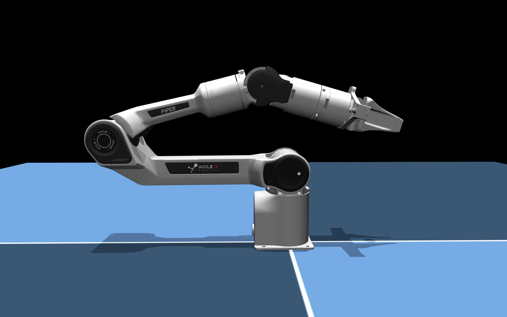

## UMI-Gripper Description (MJCF)

> Requires MuJoCo 2.2.2 or later.

### Overview

This package contains a simplified robot description (MJCF) of the [Agilex PiPER](https://global.agilex.ai/products/piper). It is derived from the publicly available [model](https://github.com/agilexrobotics/Piper_ros/tree/ros-noetic-no-aloha/src/piper_description/urdf).

  

### Derivation steps

1.  Added `<mujoco> <compiler balanceinertia="true" discardvisual="false"/> </mujoco>` to the URDF's
   `<robot>` clause in order to preserve visual geometries.
2. Loaded the URDF into MuJoCo and saved a corresponding MJCF.
3. Converted the the .objs to .xmls using [obj2mjcf](https://github.com/kevinzakka/obj2mjcf) and replaced the original stls with them (since each obj in mujoco can have 1 color).
4. Merged similar materials between the .objs
5. Created a `<default>` section to define common properties for joints, actuators, and geoms.
6. Added a `<tendon>` section with a fixed tendon named split to synchronize the movement of both fingers of hte gripper.
7. Added `scene.xml` which includes the robot, with a textured groundplane, skybox, and haze.

## License

This model is released under an [MIT License](LICENSE).
