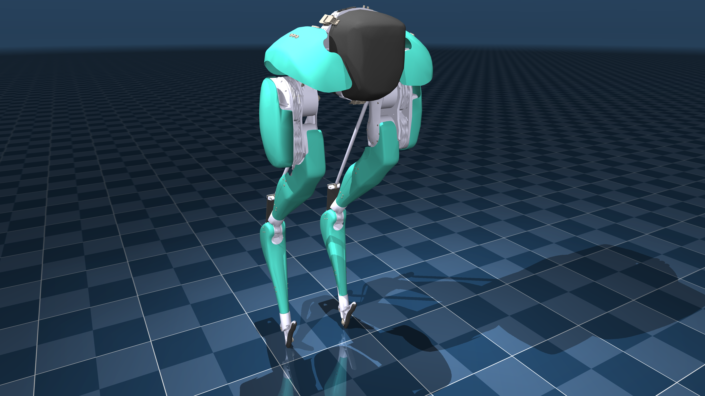

# Agility Cassie Description (MJCF)

## Overview

This package contains a simplified robot description (MJCF) of the Cassie
bipedal robot. The original MJCF and assets were provided directly by
[Agility Robotics](http://www.agilityrobotics.com/) under an
[MIT License](LICENSE).

  

## Modifications made to the original model

1. Replaced single quotes with double quotes.
2. Made collision geoms visible, put them in hidden group 3.
3. Removed `nuser_actuator` and `nuser_sensor` (automatically inferred since
   MuJoCo 2.1.2).
4. Changed solver from PGS to Newton.
5. Removed `<visual>` clause.
6. Removed attribute specs which are already default.
7. Improved collision geometry.
8. Added `scene.xml` which includes the robot, with a textured groundplane, skybox, and haze.

## License

This model is released under an [MIT License](LICENSE).
