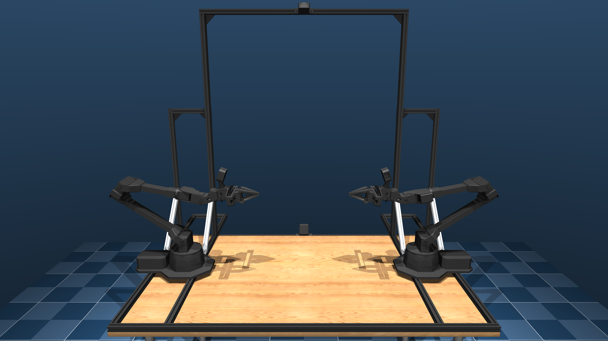
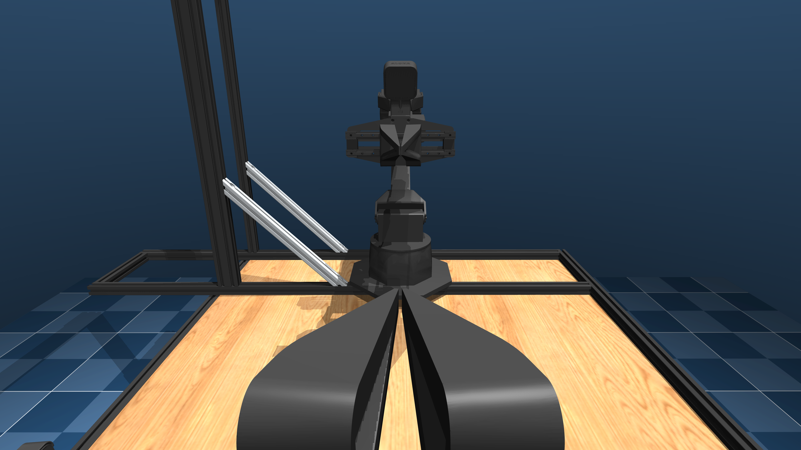

# ALOHA Description (MJCF)

> [!IMPORTANT]
> Requires MuJoCo 3.1.1 or later.

## Changelog

See [CHANGELOG.md](./CHANGELOG.md) for a full history of changes.

## Overview

This package contains a simplified robot description (MJCF) of the bimanual [ALOHA 2](https://aloha-2.github.io/) robot. It is derived from the publicly available [ViperX 300 6DOF](https://github.com/google-deepmind/mujoco_menagerie/tree/main/trossen_vx300s) MJCF model.

<p float="left">
  
  
</p>

## URDF → MJCF derivation steps

1. Branched XML from [ViperX 300](../trossen_vx300s/), duplicating robot kinematic tree twice, one for the left arm and one for the right arm.
2. Replaced default ViperX gripper model with the updated ALOHA 2 design and modeled the actuation using a position controlled linear actuator with an equality constraint between the left and right gripper fingers.
3. Performed system identification of actuator gain and torque limits and joint damping, armature and friction parameters as follows:
    1. Collected 11 trajectories in real using the leader arms consisting of sinusoidal motions targeting the control limits of the motors in the follower arms.
    2. Recorded joint positions and velocities on the follower arms.
    3. Solved a box-constrained nonlinear least squares problem that minimizes the residual between real and simulated data.
    4. Updated aforementioned parameters in the MJCF model.
4. Added `scene.xml` which includes the robots mounted on an aluminum extrusion frame bolted to a wooden table.
5. Added 4 cameras: overhead camera, worms-eye camera and left and right wrist cameras. The intrinsic parameters of the simulated cameras are matched with an [Intel RealSense D405](https://www.intelrealsense.com/depth-camera-d405/).

## License

This model is released under a [BSD-3-Clause License](LICENSE).

## Publications

If you use this model in your work, please use the following citation:

```bibtex
@misc{aloha2_2024,
    title = {ALOHA 2: An Enhanced Low-Cost Hardware for Bimanual Teleoperation},
    url = {https://aloha-2.github.io/},
    author = {ALOHA 2 Team},
    year = {2024},
}
```
