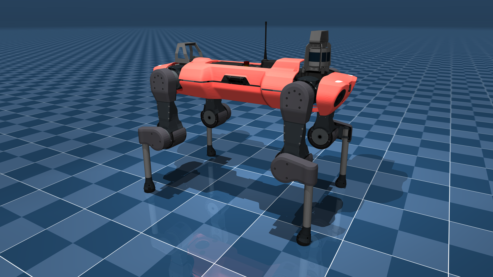

# ANYmal C Description (MJCF)

> [!IMPORTANT]
> Requires MuJoCo 2.2.2 or later.

## Changelog

See [CHANGELOG.md](./CHANGELOG.md) for a full history of changes.

## Overview

This package contains a simplified robot description (MJCF) of the [ANYmal C
robot](https://www.anybotics.com/anymal) developed by
[ANYbotics](https://www.anybotics.com). It is derived from the [publicly
available URDF
description](https://github.com/ANYbotics/anymal_c_simple_description).

  

## Colab

* [MJX] Use first-order policy gradients to make the ANYmal C locomote
   

## URDF → MJCF derivation steps

1. Converted the DAE [mesh
   files](https://github.com/ANYbotics/anymal_c_simple_description/tree/master/meshes)
   to OBJ format using [Blender](https://www.blender.org/).
2. Processed `.obj` files with [`obj2mjcf`](https://github.com/kevinzakka/obj2mjcf).
3. Added `<mujoco> <compiler discardvisual="false"/> </mujoco>` to the
   [URDF](https://github.com/ANYbotics/anymal_b_simple_description/blob/master/urdf/anymal.urdf)'s
   `<robot>` clause in order to preserve visual geometries.
4. Loaded the URDF into MuJoCo and saved a corresponding MJCF.
5. Added a `<freejoint/>` to the base, and a tracking light.
6. Manually edited the MJCF to extract common properties into the `<default>` section.
7. Added `<exclude>` clauses to prevent collisions between the base and the thighs.
8. Added position-controlled actuators, roughly corresponding to the motor spec
   [here](https://doi.org/10.1080/01691864.2017.1378591).
9. Added joint damping to correspond to D gains of the same spec.
10. Added joint frictionloss to correspond to torque resolution of the same spec.
11. Softened the contacts of the feet to approximate the effect of rubber.
12. Added `scene.xml` which includes the robot, with a textured groundplane, skybox, and haze.

### MJX

A version of the ANYmal C model for use in [MJX](https://mujoco.readthedocs.io/en/stable/mjx.html) is available in `scene_mjx.xml` with the following changes:

* The solver `iterations` and `ls_iterations` were modified for performance.
* `frictionloss` was removed.
* A custom `init_qpos` was added.
* The friction cone was changed from elliptic to pyramidal.
* All contacts other than the sphere geoms on the feet were turned off. Contact dimensionality was changed from 6 to 3.
* Pairwise contacts between feet were turned off to speed up simulation.
* The compiler option was changed to `<option iterations="1" solver="Newton"/>`, with `<flag eulerdamp="disable"/>`.
* Some decorative geoms were removed from the torso, to speed up rendering.

*Hint*: Call `mujoco.MjModel.from_xml_path` on `scene.xml` or `scene_mjx.xml`, not on the Anymal files!

## License

This model is released under a [BSD-3-Clause License](LICENSE).

## Acknowledgments

The MJX model of the ANYmal C was contributed by [Andrew Luo](https://github.com/Andrew-Luo1).
