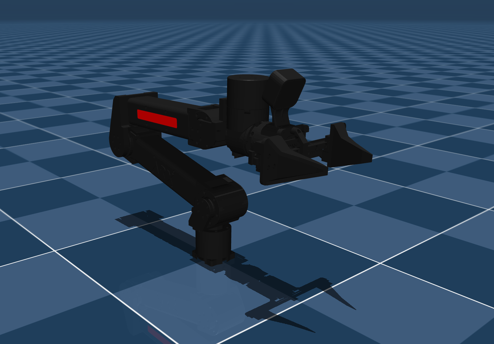

## ARX L5 Description (MJCF)

> [!IMPORTANT]
> Requires MuJoCo 3.1.3 or later.

## Changelog

See [CHANGELOG.md](./CHANGELOG.md) for a full history of changes.

### Overview

This package contains a simplified robot description (MJCF) of the [ARX L5](https://arx-x.com/). It is derived from [ARX's official model repository](https://github.com/ARXroboticsX/ARX_Model). The initial URDF can be found at the following [commit SHA](https://github.com/ARXroboticsX/ARX_Model/tree/af6fe43c873008a85bce6195c0f2160f1a1c14ce/X5/X5A).

  

### Derivation steps

1.  Added `<mujoco> <compiler balanceinertia="true" discardvisual="false"/> </mujoco>` to the URDF's
    `<robot>` clause in order to preserve visual geometries.
2.  Loaded the URDF into MuJoCo and saved a corresponding MJCF.
3.  Converted the .stls to .objs and replaced the original .stls with them (since each .obj in MuJoCo can have 1 color).
4.  Merged similar materials between the .objs.
5.  Created a `<default>` section to define common properties for joints, actuators, and geoms.
6.  Added an equality constraint so that the right finger mimics the position of the left finger.
7.  Manually designed box collision geoms for the gripper.
8.  Added `exclude` clause to prevent collisions between `base_link` and `link1`.
9.  Added position controlled actuators.
10. Added `impratio=10` and `cone=elliptic` for better noslip.
11. Added `scene.xml` which includes the robot with a textured groundplane, skybox, and haze.

## License

This model is released under a [BSD-3-Clause License](LICENSE).

## Acknowledgement

This model was graciously contributed by [Jonathan Zamora](https://jonzamora.dev/).
