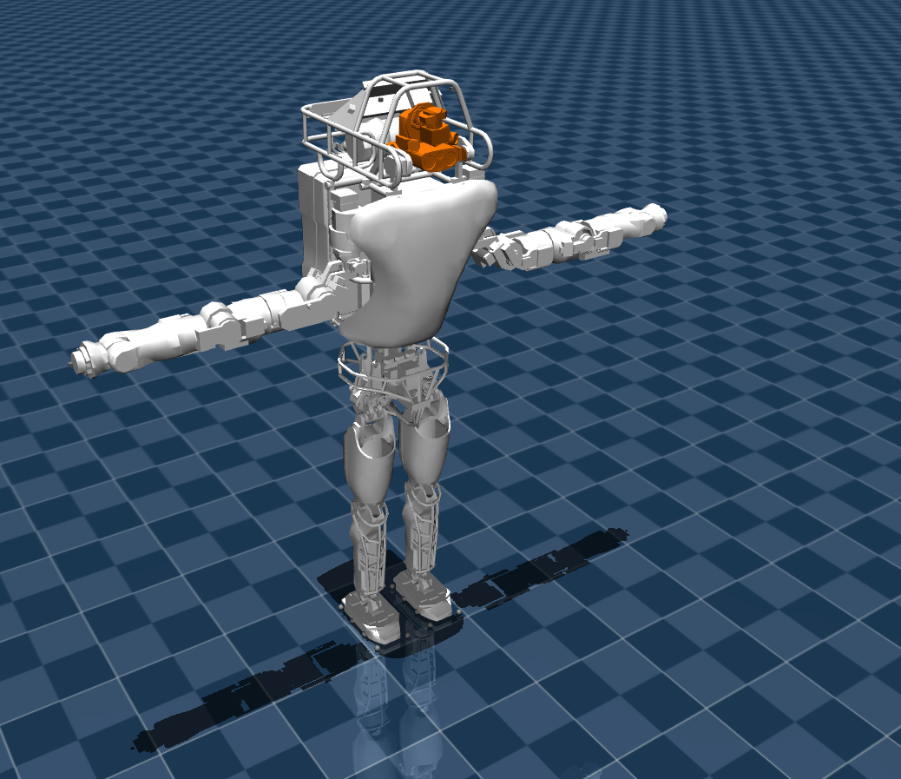

# Atlas description (MJCF)

## Overview

This package contains a robot description (MJCF) of the [Atlas](https://bostondynamics.com/atlas/). It is derived from the [publicly available URDF description](https://github.com/RobotLocomotion/drake/tree/73a8da32cd41ff7fd023c3680f8250860cbd0e6b/examples/atlas/urdf) of the [Drake](https://drake.mit.edu/) project.

  

## URDF → MJCF derivation steps

1. Downloaded OBJ format meshes from the [repository](https://github.com/RobotLocomotion/drake/tree/73a8da32cd41ff7fd023c3680f8250860cbd0e6b/examples/atlas/urdf/meshes)
2. Added `<mujoco> <compiler discardvisual="false"/> </mujoco>` to the [URDF](https://github.com/RobotLocomotion/drake/blob/73a8da32cd41ff7fd023c3680f8250860cbd0e6b/examples/atlas/urdf/atlas_minimal_contact.urdf) in order to preserve visual geometries.
3. Loaded the URDF into MuJoCo and saved a corresponding MJCF. Be aware that original repository contains an alternative [URDF represenatation](https://github.com/RobotLocomotion/drake/blob/73a8da32cd41ff7fd023c3680f8250860cbd0e6b/examples/atlas/urdf/atlas_convex_hull.urdf) with more contacts, but I was unable to load it into MuJoCo.
4. Manually edited the MJCF to extract into the `<default>` section geometries with meshes.
5. Added torque-controlled actuators for the robot.
6. Lifted `pelvis` body to 0.95 in order for the robot to almost stand on the ground.
7. Added `scene.xml` which includes the robot, with a groundplane and skybox.
