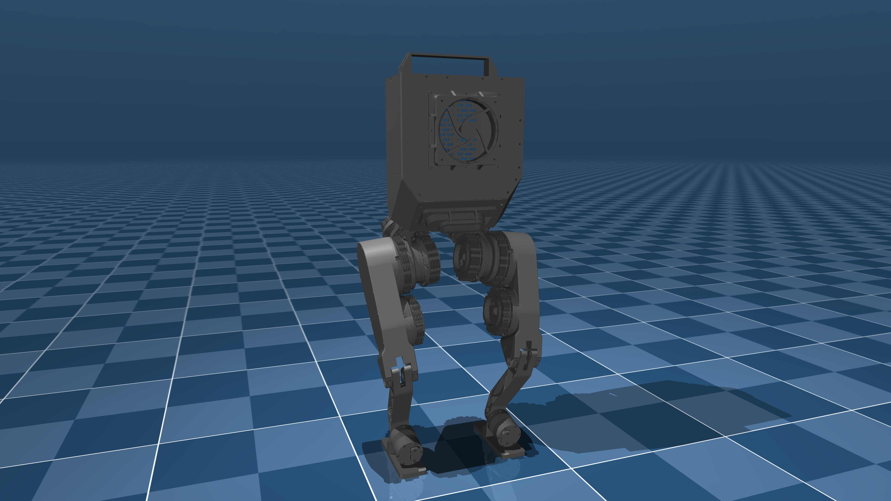

# Berkeley Humanoid Description (MJCF)

> [!IMPORTANT]
> Requires MuJoCo 2.3.4 or later.

## Changelog

See [CHANGELOG.md](./CHANGELOG.md) for a full history of changes.

## Overview

This package contains a simplified robot description (MJCF) of the [Berkeley
Humanoid](https://berkeley-humanoid.com/) developed by the [Hybrid Robotics
Lab](https://hybrid-robotics.berkeley.edu/) at UC Berkeley. It is derived from the [publicly available URDF description](https://github.com/HybridRobotics/berkeley_humanoid_description).

<p float="left">
  
</p>

## URDF → MJCF derivation steps

1. Manually edited the MJCF to extract common properties into the `<default>` section.
2. Added a spotlight and tracking light.
3. Added a site for the IMU.
4. Added a camera for tracking.
5. Extracted joint and actuator properties from the [IsaacLab training code](https://github.com/HybridRobotics/isaac_berkeley_humanoid).
6. Added `scene.xml` which includes the robot, with a textured groundplane, skybox, and haze.

## License

This model is released under a [BSD-3-Clause License](LICENSE).

## Publications

The Berkeley Humanoid is described in the following publication:

```bibtex
@misc{2407.21781,
    Author = {Qiayuan Liao and Bike Zhang and Xuanyu Huang and Xiaoyu Huang and Zhongyu Li and Koushil Sreenath},
    Title = {Berkeley Humanoid: A Research Platform for Learning-based Control},
    Year = {2024},
    Eprint = {arXiv:2407.21781},
}
```
