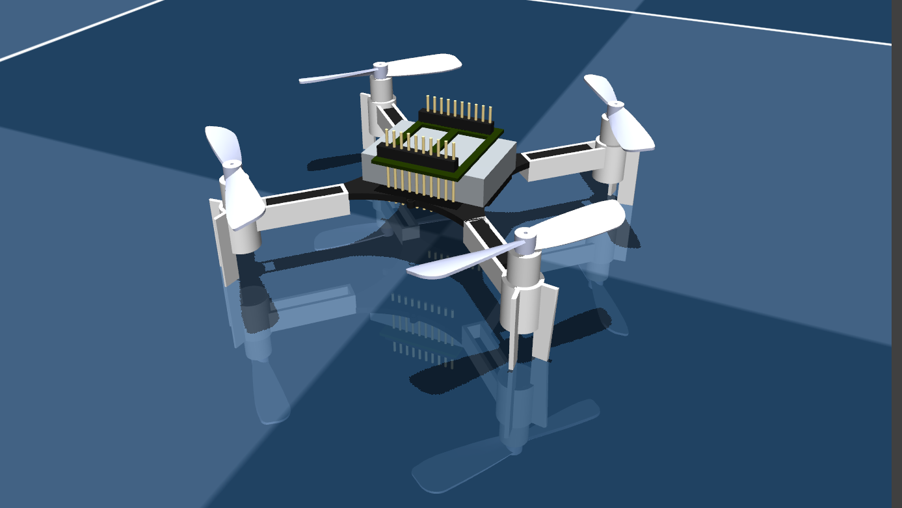

# Bitcraze Crazyflie 2 Description (MJCF)

> [!IMPORTANT]
> Requires MuJoCo 2.2.2 or later.

## Changelog

See [CHANGELOG.md](./CHANGELOG.md) for a full history of changes.

## Overview

This package contains a simplified robot description (MJCF) of the Crazyflie 2
model from [Bitcraze](https://www.bitcraze.io/). It is derived from the publicly
available [ROS description](https://github.com/whoenig/crazyflie_ros).

  

## URDF → MJCF Conversion

1. Converted the DAE mesh file in `crazyflie_description` to OBJ format using [Blender](https://www.blender.org/).
2. Processed the OBJ file with [obj2mjcf](https://github.com/kevinzakka/obj2mjcf).
3. Added a `<freejoint>` to the root body, and some lighting in the XML file.
4. Set the inertial properties to values obtained from the datasheet and [MIT's system identification](https://groups.csail.mit.edu/robotics-center/public_papers/Landry15.pdf)
    * These properties are set via inertial tag i.e. `pos ="0 0 0" mass="0.027" diaginertia="2.3951e-5 2.3951e-5 3.2347e-5"`
5. Added combined thrust and body moments about a `site` placed at the inertial frame. The `ctrlrange` limits are currently arbitrary and need to be further tuned.
6. Added `scene.xml` which includes the quadrotor, with a textured ground plane and skybox.

## License

This model is released under an [MIT License](LICENSE).
