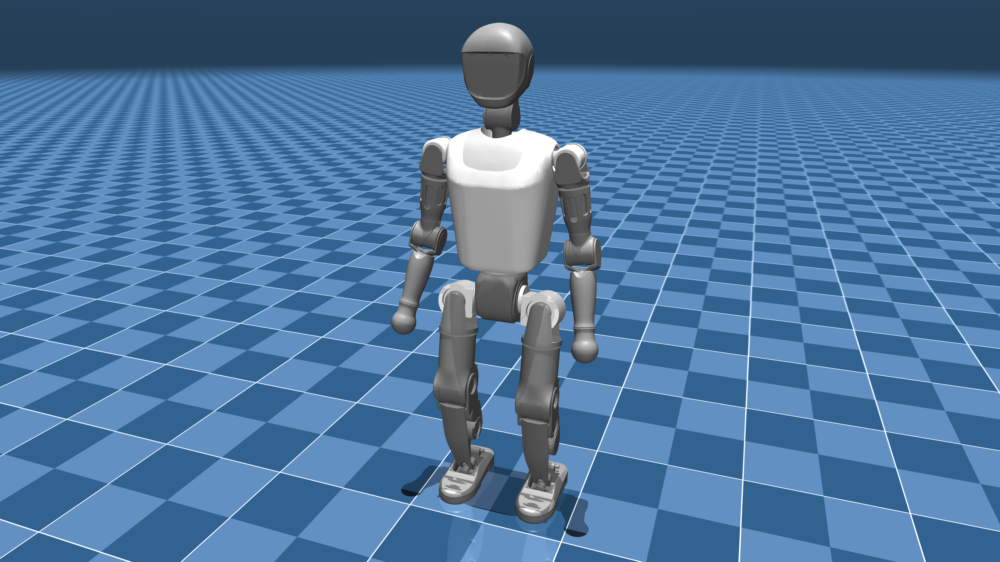

# Booster T1 Description (MJCF)

> [!IMPORTANT]
> Requires MuJoCo 2.3.4 or later.

## Changelog

See [CHANGELOG.md](./CHANGELOG.md) for a full history of changes.

## Overview

This package contains a simplified robot description (MJCF) of the [T1 Humanoid
Robot](https://www.boosterobotics.com/robots/) developed by [Booster
Robotics](https://www.boosterobotics.com/). It is derived from the [publicly available
URDF
description](https://github.com/BoosterRobotics/booster_gym/blob/main/resources/T1/T1_serial.urdf).

  

## MJCF derivation steps

1. Started from `t1_serial.urdf`.
2. Added the following to the URDF `<robot>` tag `<mujoco><compiler balanceinertia="true" discardvisual="false" fusestatic="false" strippath="false"/></mujoco>`.
3. Loaded the URDF into MuJoCo and saved a corresponding MJCF.
4. Added freejoint to trunk.
5. Added imu site to trunk at position `"0 0 0"`.
6. Added home keyframe.
7. Added tracking light.
8. Add frictionloss + armature to joints (not identified) for added stability.
9. Switched to implicitfast and used position actuators with kp/kv semantics.
10. Added IMU sensors.

## License

This model is released under an [Apache-2.0 License](LICENSE).
