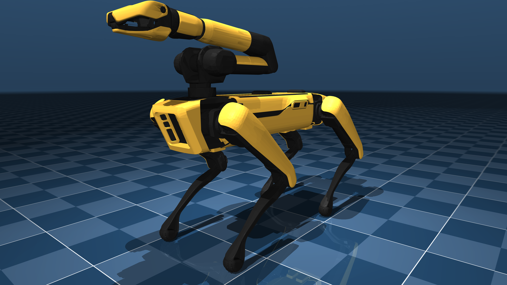

# Boston Dynamics Spot Description (MJCF)

> [!IMPORTANT]
> Requires MuJoCo 3.1.3 or later.

## Changelog

See [CHANGELOG.md](./CHANGELOG.md) for a full history of changes.

## Overview

This package contains a simplified robot description (MJCF) of the [Spot
Quadruped](https://bostondynamics.com/products/spot/) developed by [Boston
Dynamics](https://bostondynamics.com/). It is derived from the [publicly
available URDF description](https://github.com/bdaiinstitute/spot_ros2).

  

## URDF → MJCF Conversion

1. Processed `.obj` files with [`obj2mjcf`](https://github.com/kevinzakka/obj2mjcf).
2. Added `<mujoco> <compiler discardvisual="false" strippath="false" fusestatic="false"/> </mujoco>` to the URDF's
   `<robot>` clause in order to preserve visual geometries.
3. Loaded the URDF into MuJoCo and saved a corresponding MJCF.
    * The spot XML was derived from [spot_simple.urdf.xacro](https://github.com/bdaiinstitute/spot_ros2/blob/main/spot_description/urdf/spot_simple.urdf.xacro).
    * The arm XML was derived from [spot_arm_macro.urdf](https://github.com/bdaiinstitute/spot_ros2/blob/main/spot_description/urdf/spot_arm_macro.urdf).
4. Added a `<freejoint/>` to the base, and a tracking light.
5. Manually edited the MJCF to extract common properties into the `<default>` section.
6. Added `<exclude>` clauses to prevent collisions between the base and the upper legs.
7. Added position actuators (not tuned).
8. Added a home keyframe.
9. Added `scene.xml` which includes the robot, with a textured groundplane, skybox, and haze.

## License

This model is released under a [BSD-3-Clause License](LICENSE).
