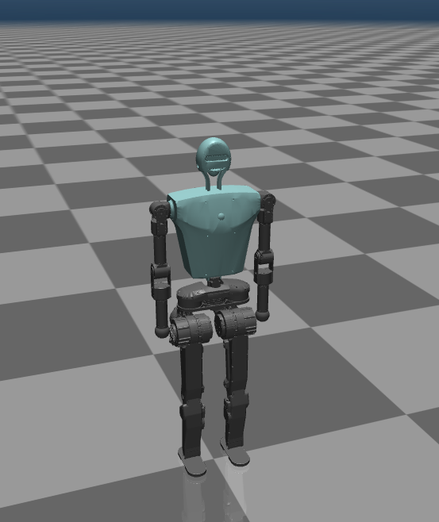

# BXI Elf2 Description (MJCF)

Requires MuJoCo 2.3.3 or later.

## Overview

This package contains a humanoid robot description (MJCF) of BXI Elf2 developed by [BXI Robotics](https://bxirobotics.com).    

Elf2_dof25 is a 25 DOF description of the Robot.    

<p float="left">
  
</p>

## View the model in Mujoco
```
python -m mujoco.viewer --mjcf path/to/mujoco_menagerie/bxi_elf2/scene.xml
```

## License

This model is released under an [Apache-2.0 License](LICENSE).
