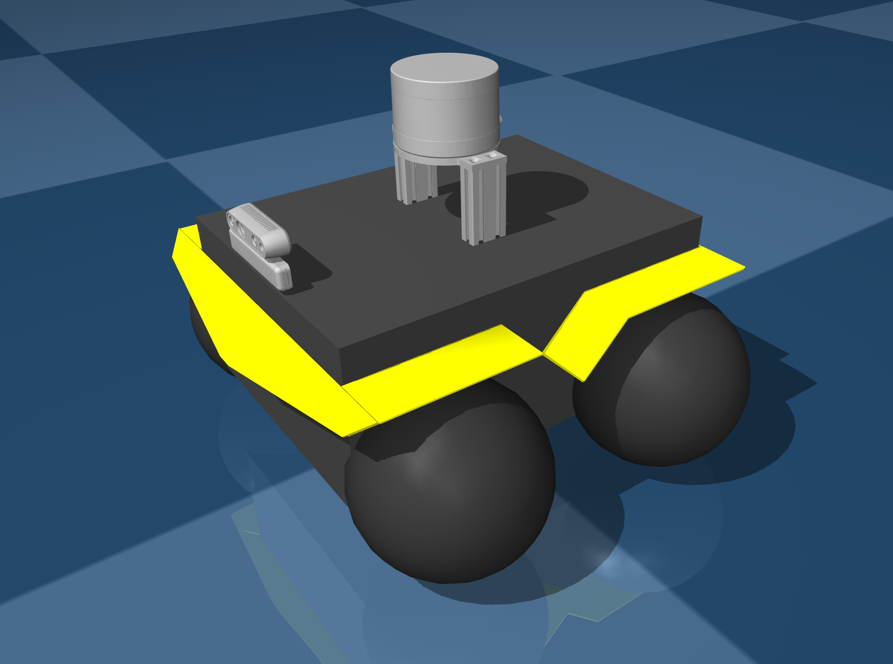

# ClearPath Jackal Description (MJCF)

Requires MuJoCo 2.2.2 or later.

## Overview

This package contains a modified robot description (MJCF) of the ClearPath
Jackal robot. Wheels are modeled with Capsule, additional RealSense and
Velodyne sensors are added. The original URDF and assets were provided directly by
[ClearPath Robotics](https://clearpathrobotics.com) under an
[BSD-3-Clause License](LICENSE).

<p float="left">
  
</p>

## License

This model is released under an [BSD-3-Clause License](LICENSE).

## Citation

If you use this work in an academic context, please cite the following publication:

```bibtex
@inproceedings{
    yu2024adaptive,
    title={Adaptive Diffusion Terrain Generator for Autonomous Uneven Terrain Navigation},
    author={Youwei Yu and Junhong Xu and Lantao Liu},
    booktitle={8th Annual Conference on Robot Learning},
    year={2024},
    url={https://openreview.net/forum?id=xYleTh2QhS}
}
```
