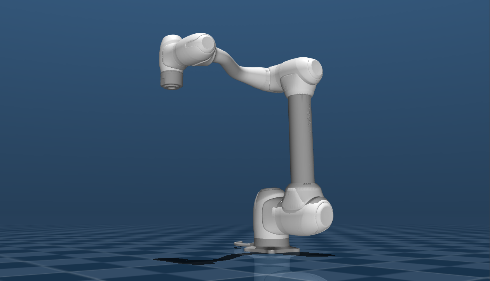

# Doosan Robotics M1013 (MJCF)

> [!IMPORTANT]
> Requires MuJoCo 3.1.3 or later.

## Changelog

See [CHANGELOG.md](./CHANGELOG.md) for a full history of changes.

## Overview

This package contains a simplified robot description (MJCF) of the [M1013 white series](https://www.doosanrobotics.com/en/product-solutions/product/m-series/m1013/) developed by [Doosan Robotics](https://www.doosanrobotics.com/en). It is derived from the [publicly available URDF description](https://github.com/DoosanRobotics/doosan-robot2).

  

## URDF → MJCF derivation steps

1. Ran the XACRO generation cli to convert the [original file](https://github.com/DoosanRobotics/doosan-robot2/blob/humble/dsr_description2/xacro/m1013.urdf.xacro) to URDF.
    * Command used: `xacro m1013.urdf.xacro > output.urdf`
2. Converted the DAE visual meshes to STL using [MeshLab](https://www.meshlab.net/) and change the paths.
3. Added `<mujoco> <compiler meshdir="assets" balanceinertia="true" discardvisual="false" /> </mujoco>` to the URDF's `<robot>` clause.
4. Loaded the URDF into MuJoCo and saved a corresponding MJCF.
5. Add material color for better match the real world.
6. Manually edited the MJCF to extract common properties into the `<default>` section.
7. Added position-controlled actuators for the arm and keyframe.
8. Added `scene.xml` which includes the robot, with a textured groundplane, skybox, and haze.

## License

This model is released under an [BSD 3-Clause License](LICENSE).