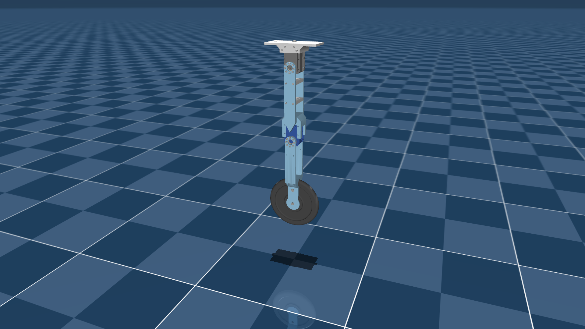

# Dynamixel 2R

## Overview

This package contains a 2R testbench arm featuring MX-106 and MX-64 Dynamixel actuators.

The motor parameters are the best fit using system identification, for *kp=32* and *vin=15V*.
However, as described in the [related paper](https://arxiv.org/pdf/2410.08650v1), enhanced friction
modeling can be used to greatly improve the fidelity of the simulation of such system.

  

## CAD → MJCF conversion

The model was converted using [onshape-to-robot](https://onshape-to-robot.readthedocs.io/) from the [Onshape CAD assembly](https://cad.onshape.com/documents/c261e707fbd05d9a111bbdd3/w/2b2b7908e9fc282f8fc113ce/e/67a067163b98ae778d880134).

The [config.json](config.json) with export configuration file is also present in this package.

## See also

* [BAM repository](https://github.com/rhoban/bam): exploring extended modeling of the friction.

## License

This model is released under an [MIT License](LICENSE).
