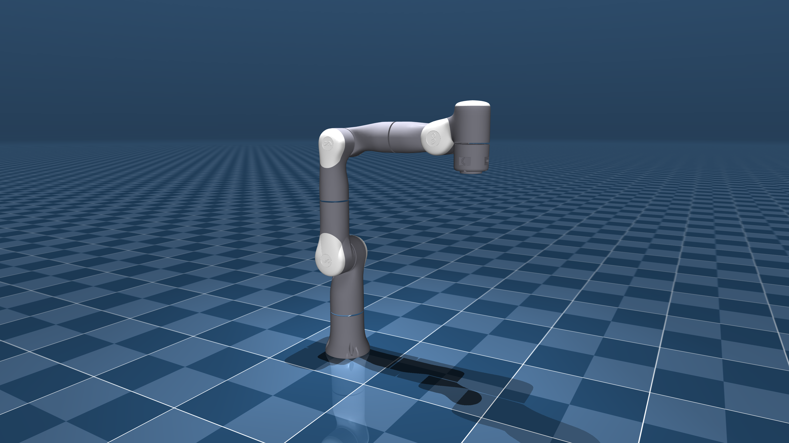

# Flexiv Robotics Rizon4 Description (MJCF)

> [!IMPORTANT]
> Requires MuJoCo 3.1.3 or later.

## Changelog

See [CHANGELOG.md](./CHANGELOG.md) for a full history of changes.

## Overview

This package contains a MuJoCo robot description (MJCF) of [Rizon4](https://www.flexiv.com/products/rizon) developed by [Flexiv Robotics](https://www.flexiv.com/).

  

## URDF → MJCF derivation steps

1. Loaded the URDF into MuJoCo and saved a corresponding MJCF.
2. Manually edited the MJCF to extract common properties into the `<default>` section.
3. Added position-controlled actuators for the arm with three default classes
   (`joint1`, `joint2`, `joint3`) matching the three motor sizes and their
   respective `actuatorfrcrange` limits (123, 64, and 39 Nm).
4. Rounded material properties (specular, shininess, rgba) to 2 significant
   digits.
5. Computed per-joint PD gains (`kp`, `kv`) from the diagonal of the joint-space
   mass matrix at the home configuration. The gains follow a second-order
   response model:
   - `kp = M_ii * w_n^2`
   - `kv = 2 * zeta * M_ii * w_n`

   Natural frequencies are chosen per actuator class so that each actuator
   saturates at approximately 10 degrees of position error (1.5 Hz for `joint1`,
   2.0 Hz for `joint2`, 6.0 Hz for `joint3`), with a critically damped response
   (zeta = 1). See [`compute_gains.py`](compute_gains.py) to reproduce or
   adjust these values.
6. Added a `home` keyframe.
7. Added `scene.xml` which includes the robot, with a textured groundplane,
   skybox, and haze.

## License

This model is released under an [Apache-2.0 License](LICENSE).
