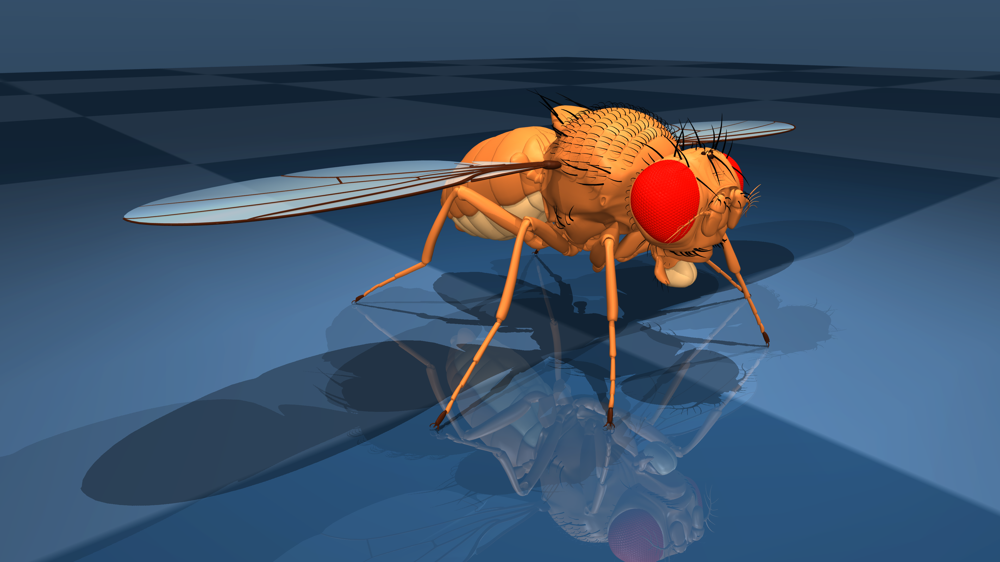
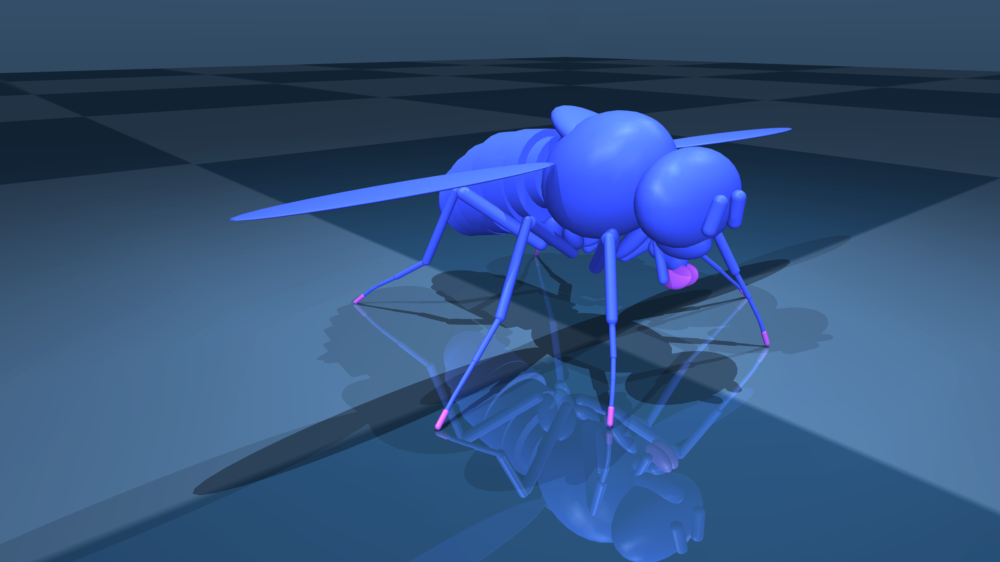

# Flybody Description (MJCF)

> [!IMPORTANT]
> Requires MuJoCo 2.2.2 or later.

## Changelog

See [CHANGELOG.md](./CHANGELOG.md) for a full history of changes.

## Overview

flybody is an anatomically-detailed body model of the fruit fly [Drosophila melanogaster]. The fly model was developed in a collaborative effort by Google DeepMind and [HHMI Janelia Research Campus](https://www.janelia.org/). It is taken with permission from the [official flybody repository] ([commit SHA](https://github.com/TuragaLab/flybody/commit/736608121847c3c025fd02a629bdb016a3294f9a)). For the most up-to-date model and source of truth, the user is encouraged to refer to the [official flybody repository].

<p float="left">
  
  
</p>

## MJCF derivation steps

* In the [`build_fruitfly` directory] of the [official flybody repository], you'll find the data and code to produce this model, with a step-by-step process detailed in the [`build_fruitfly` README].
* You can also find a detailed write up of the modeling process in the methods section of the [bioRxiv paper].

## License

This model is released under an [Apache-2.0 License](LICENSE).

## Citation

If you use this work in an academic context, please cite the following publication:

```bibtex
@article{
  flybody,
  title = {Whole-body simulation of realistic fruit fly locomotion with
           deep reinforcement learning},
  author = {Roman Vaxenburg and Igor Siwanowicz and Josh Merel and Alice A Robie and
            Carmen Morrow and Guido Novati and Zinovia Stefanidi and Gwyneth M Card and
            Michael B Reiser and Matthew M Botvinick and Kristin M Branson and
            Yuval Tassa and Srinivas C Turaga},
  journal = {bioRxiv},
  doi = {https://doi.org/10.1101/2024.03.11.584515},
  url = {https://www.biorxiv.org/content/10.1101/2024.03.11.584515},
  year = {2024},
}
```

[official flybody repository]: https://github.com/TuragaLab/flybody
[Drosophila melanogaster]: https://en.wikipedia.org/wiki/Drosophila_melanogaster
[bioRxiv paper]: https://www.biorxiv.org/content/10.1101/2024.03.11.584515v1
[`build_fruitfly` directory]: https://github.com/TuragaLab/flybody/tree/main/flybody/fruitfly/build_fruitfly
[`build_fruitfly` README]: https://github.com/TuragaLab/flybody/blob/main/flybody/fruitfly/build_fruitfly/README.md
