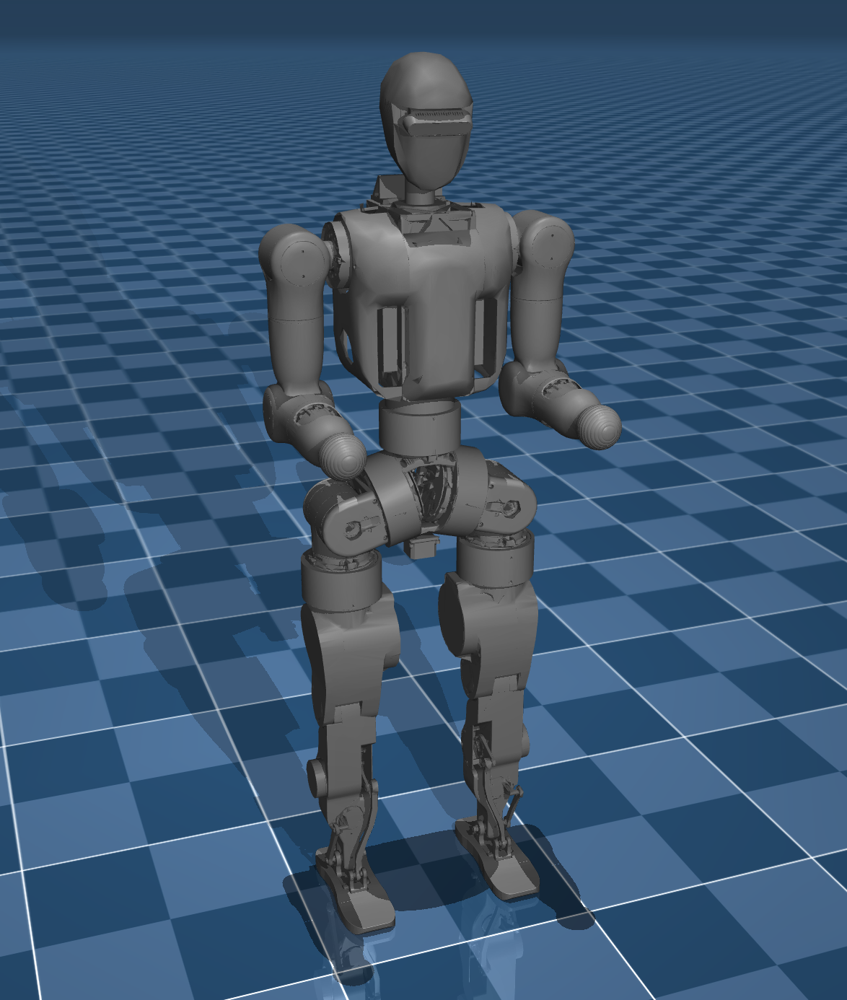

# Fourier N1 Description (MJCF)

> [!IMPORTANT]
> Requires MuJoCo 2.2.2 or later.

## Changelog

See [CHANGELOG.md](./CHANGELOG.md) for a full history of changes.

## Overview

This package contains a simplified robot description (MJCF) of the
[Fourier N1 Humanoid Robot](https://www.fftai.cn/open-source/18)
developed by
[Fourier](https://www.fftai.com).
It is derived from the
[Fourier N1 URDF Description](https://github.com/FFTAI/Wiki-GRx-Models).

  

## MJCF derivation steps

1. Started from `N1_raw.urdf` in [Fourier N1 URDF Description](https://github.com/FFTAI/Wiki-GRx-Models).
    - File SHA: `8456575a522676db6b7d0924eccfc61e4c4123cc`
2. Loaded the URDF into MuJoCo and saved a corresponding MJCF.
3. Manually edited the MJCF to extract common properties into the `<default>` section.
4. Manually edited the `<asset>` section to include the textures and meshes.
5. Manually added actuators.
6. Manually added sensors.
7. Added `scene.xml` which includes the robot, with a textured groundplane, skybox, and haze.

More information can be found [here](https://github.com/FFTAI/wiki-grx-mjcf).

## License

This model is released under an [Apache-2.0 License](LICENSE).
