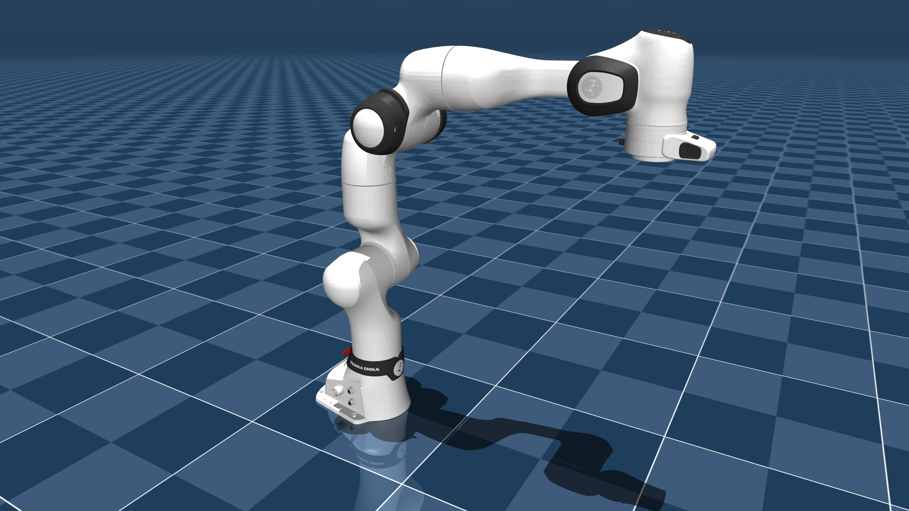

# Franka Robotics FR3 Description (MJCF)

> [!IMPORTANT]
> Requires MuJoCo 3.1.3 or later.

## Changelog

See [CHANGELOG.md](./CHANGELOG.md) for a full history of changes.

## Overview

This package contains a simplified robot description (MJCF) of the [Franka Research 3](https://franka.de/research) (aka FR3) developed by [Franka Robotics](https://franka.de/company) (formerly Franka Emika). It is derived from the [publicly available URDF description](https://github.com/frankaemika/franka_description).

  

## URDF → MJCF derivation steps

1. Ran the URDF generation [script](https://github.com/frankaemika/franka_description/blob/main/scripts/create_urdf.sh) in [franka_description](https://github.com/frankaemika/franka_description).
    * Command used: `./scripts/create_urdf.sh fr3`
2. Converted the DAE visual meshes to OBJ using [Blender](https://www.blender.org/).
    * Removed license headers in the DAE files to properly load in Blender.
    * When exporting, ensure "up axis" is +Z, and "forward axis" is +Y.
3. Processed OBJ files with [`obj2mjcf`](https://github.com/kevinzakka/obj2mjcf).
4. Added `<mujoco> <compiler discardvisual="true" strippath="false" fusestatic="false" balanceinertia="true"/> </mujoco>` to the URDF's `<robot>` clause.
5. Loaded the URDF into MuJoCo and saved a corresponding MJCF.
6. Lightened the black color used on the robot to better match the real world.
7. Manually edited the MJCF to extract common properties into the `<default>` section.
8. Added position-controlled actuators for the arm.
9. Added `scene.xml` which includes the robot, with a textured groundplane, skybox, and haze.

## License

This model is released under an [Apache-2.0 License](LICENSE).
