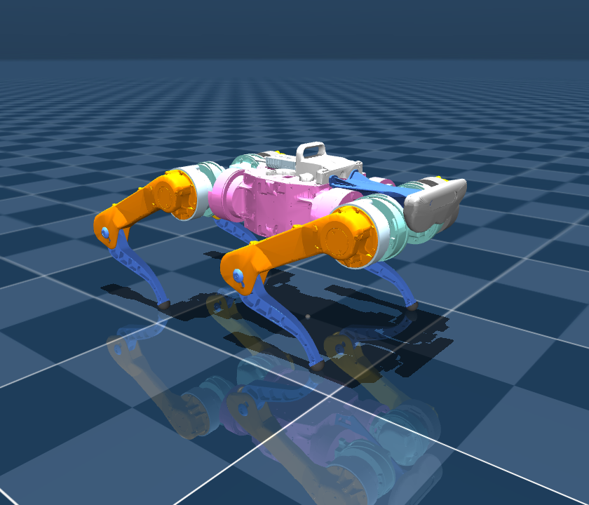
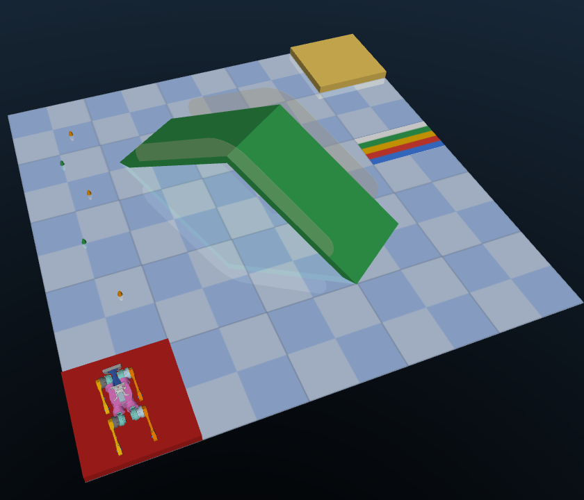

# Google Barkour v0 Description (MJCF)

Requires MuJoCo 2.2.2 or later.

## Overview

This package contains a simplified robot description (MJCF) of the [Barkour v0 Quadruped](https://ai.googleblog.com/2023/05/barkour-benchmarking-animal-level.html) developed by Google.

  

  

## MJCF and URDF

The source of truth for the Barkour v0 Quadruped can be found in `barkour_v0.xml`. The URDF in `barkour_v0.urdf` is provided for convenience.

## License

Copyright 2023 DeepMind Technologies Limited.

This model is released under an [Apache-2.0 License](LICENSE).

## Publications

If you use this work in an academic context, please cite the following publication:

    @misc{caluwaerts2023barkour,
          title={Barkour: Benchmarking Animal-level Agility with Quadruped Robots},
          author={Ken Caluwaerts and Atil Iscen and J. Chase Kew and Wenhao Yu and Tingnan Zhang and Daniel Freeman and Kuang-Huei Lee and Lisa Lee and Stefano Saliceti and Vincent Zhuang and Nathan Batchelor and Steven Bohez and Federico Casarini and Jose Enrique Chen and Omar Cortes and Erwin Coumans and Adil Dostmohamed and Gabriel Dulac-Arnold and Alejandro Escontrela and Erik Frey and Roland Hafner and Deepali Jain and Bauyrjan Jyenis and Yuheng Kuang and Edward Lee and Linda Luu and Ofir Nachum and Ken Oslund and Jason Powell and Diego Reyes and Francesco Romano and Feresteh Sadeghi and Ron Sloat and Baruch Tabanpour and Daniel Zheng and Michael Neunert and Raia Hadsell and Nicolas Heess and Francesco Nori and Jeff Seto and Carolina Parada and Vikas Sindhwani and Vincent Vanhoucke and Jie Tan},
          year={2023},
          eprint={2305.14654},
          archivePrefix={arXiv},
          primaryClass={cs.RO}
    }
