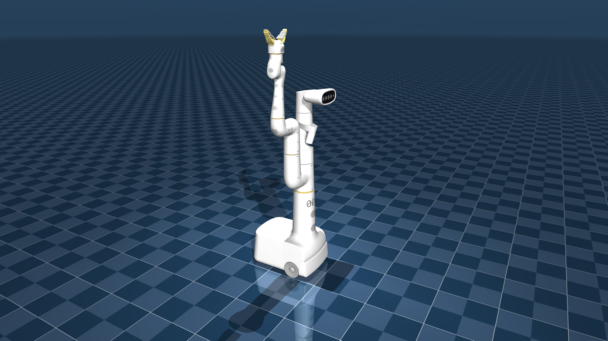

# Google Robot Description (MJCF)

> [!IMPORTANT]
> Requires MuJoCo 2.3.3 or later.

## Changelog

See [CHANGELOG.md](./CHANGELOG.md) for a full history of changes.

## Overview

This package contains a simplified robot description (MJCF) of a [mobile manipulator](https://rl-at-scale.github.io/) with a 7 degree-of-freedom (DoF) arm and a parallel jaw gripper developed by Google.

  

## License

This model is released under an [Apache-2.0 License](LICENSE).

## Publications

If you use this work in an academic context, please cite the following publication:

    @inproceedings{rlscale2023rss,
        title={Deep RL at Scale: Sorting Waste in Office Buildings with a Fleet of Mobile Manipulators},
        author={Alexander Herzog* and Kanishka Rao* and Karol Hausman* and Yao Lu* and Paul Wohlhart* and Mengyuan Yan and Jessica Lin and Montserrat Gonzalez Arenas and Ted Xiao and Daniel Kappler and Daniel Ho and Jarek Rettinghouse and Yevgen Chebotar and Kuang-Huei Lee and Keerthana Gopalakrishnan and Ryan Julian and Adrian Li and Chuyuan Kelly Fu and Bob Wei and Sangeetha Ramesh and Khem Holden and Kim Kleiven and David Rendleman and Sean Kirmani and Jeff Bingham and Jon Weisz and Ying Xu and Wenlong Lu and Matthew Bennice and Cody Fong and David Do and Jessica Lam and Yunfei Bai and Benjie Holson and Michael Quinlan and Noah Brown and Mrinal Kalakrishnan and Julian Ibarz and Peter Pastor and Sergey Levine
    },
        booktitle={Robotics: Science and Systems (RSS)},
        year={2023}
    }
