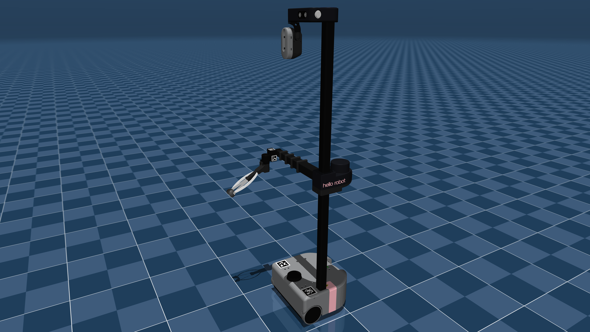

# Hello Robot Stretch 2 Description (MJCF)

> [!IMPORTANT]
> Requires MuJoCo 3.3.0 or later.

## Changelog

See [CHANGELOG.md](./CHANGELOG.md) for a full history of changes.

## Overview

This package contains a simplified robot description (MJCF) of the [Hello Robot Stretch 2](https://hello-robot.com/product) developed by [Hello Robot](https://hello-robot.com/). The original URDF and assets were provided directly by Hello Robot under the [Clear BSD License](LICENSE).

  

## URDF → MJCF derivation steps

1. Processed `.obj` files with [`obj2mjcf`](https://github.com/kevinzakka/obj2mjcf).
2. Added `<mujoco> <compiler discardvisual="false" fusestatic="false" balanceinertia="true"/> </mujoco>` to the URDF's
   `<robot>` clause in order to preserve visual geometries.
3. Loaded the URDF into MuJoCo and saved a corresponding MJCF.
4. Manually edited the MJCF to extract common properties into the `<default>` section.
5. Added actuators.
6. Added <exclude> clauses to prevent collisions in the telescoping arm.
7. Added `scene.xml` which includes the robot, with a textured groundplane, skybox, and haze.

## License

This model is released under a [Clear BSD License](LICENSE).

## Acknowledgement

This model would not be possible without the help and patience of [Binit Shah](https://binitshah.github.io/).
