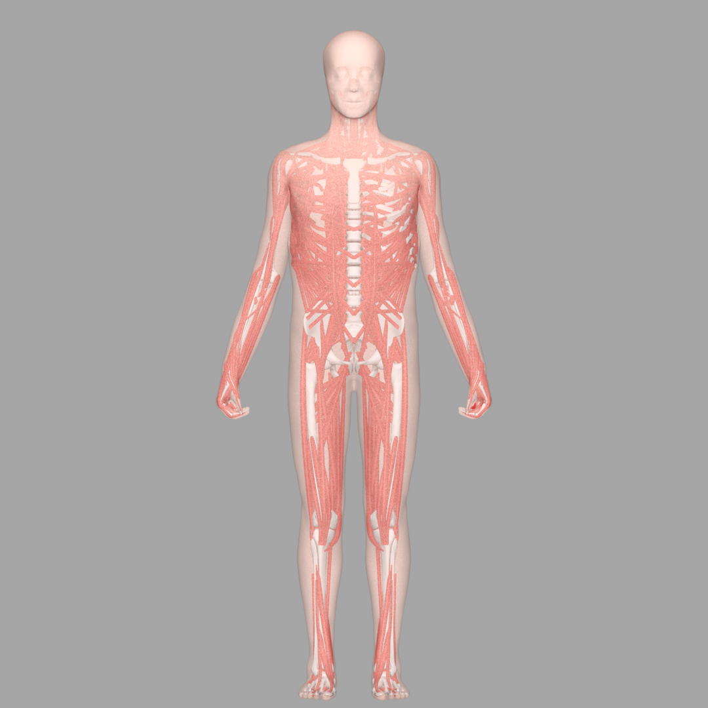
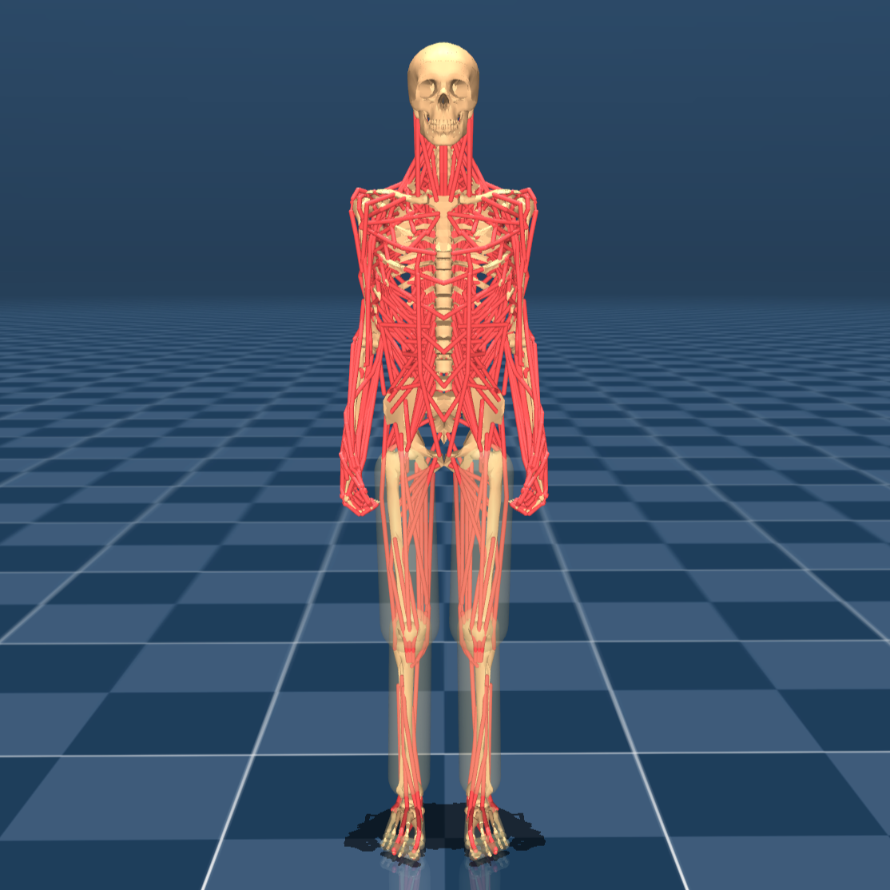
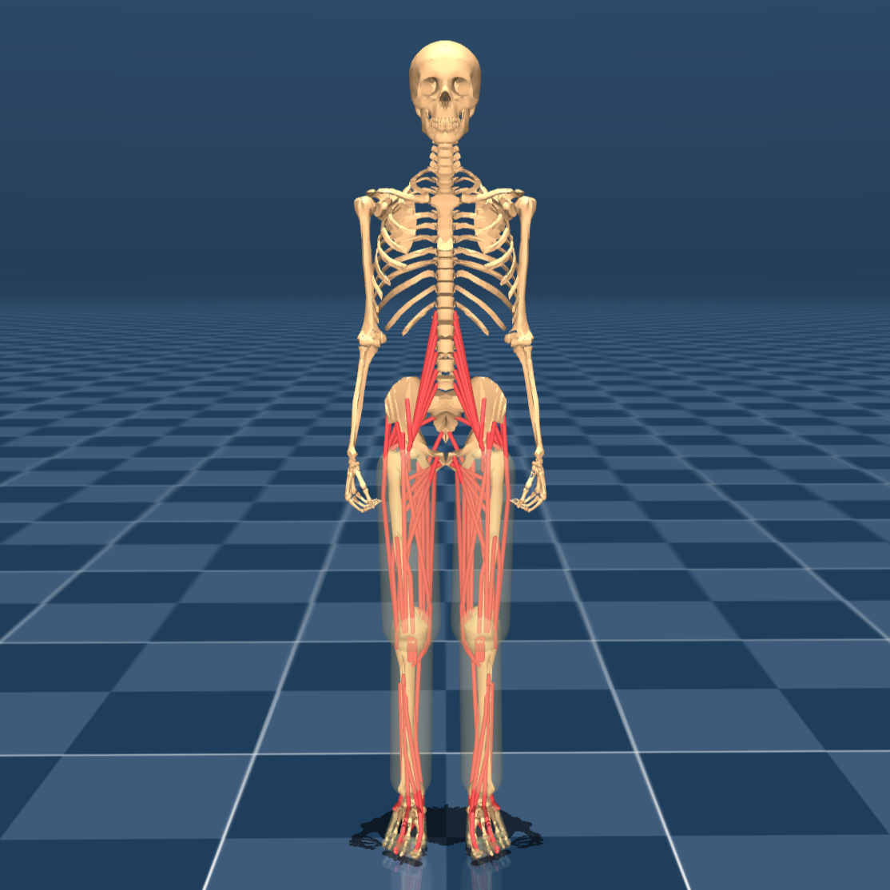
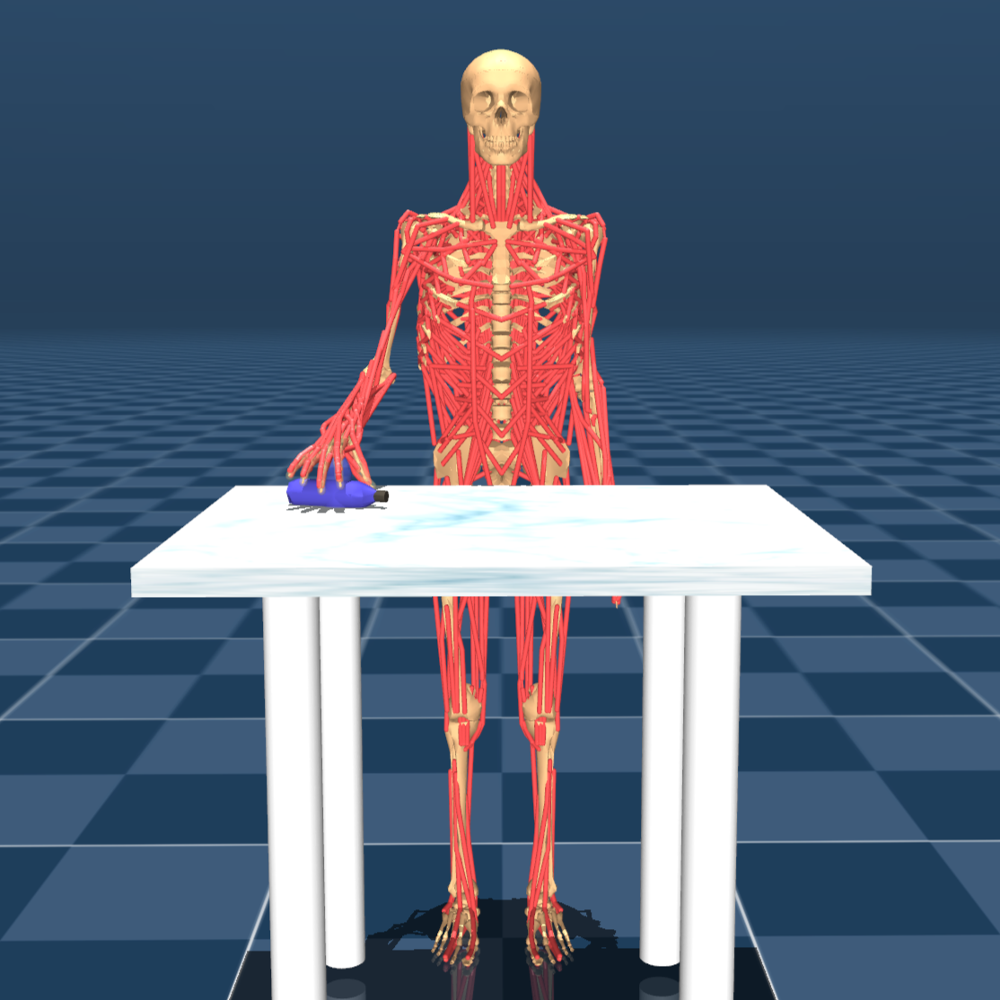

# MS-Human-700 Description (MJCF)

> [!IMPORTANT]
> Requires MuJoCo 3.2.6 or later.

## Changelog

See [CHANGELOG.md](./CHANGELOG.md) for a full history of changes.

## Overview

This package contains a Human MusculoSkeletal model description (MJCF) of the
[MS-Human-700 model](https://lnsgroup.cc/research/MS-Human) developed by the
[LNS Group](https://lnsgroup.cc/). It is
adapted from the [official MS-Human-700 repository], which remains the source of truth for the latest version of the model.

The package includes three model variants:

* [MS-Human-700.xml](./MS-Human-700.xml): full-body musculoskeletal model.
* [MS-Human-700-Locomotion.xml](./MS-Human-700-Locomotion.xml): locomotion-focused variant with a simplified upper body.
* [MS-Human-700-Manipulation.xml](./MS-Human-700-Manipulation.xml): manipulation-focused variant with a detailed right arm and hand together with a graspable bottle.

Viewer-ready scene files are also provided:

* [scene.xml](./scene.xml)
* [scene_locomotion.xml](./scene_locomotion.xml)
* [scene_manipulation.xml](./scene_manipulation.xml)

<p float="left">
  
</p>

<p float="left">
  
  
  
</p>

## MJCF derivation steps

1. Started from the MJCF and asset files provided in the [official MS-Human-700 repository].
2. Reorganized meshes, tendons, muscles, contacts, equality constraints, and body subtrees into reusable XML components under [`assets/`](./assets/).
3. Added scene files so the models can be loaded directly in the MuJoCo viewer.

## License

This model is released under an [Apache-2.0 License](LICENSE).

## Citation

If you use this work in an academic context, please cite the following publication:

```bibtex
@inproceedings{zuo2024self,
  title={Self model for embodied intelligence: Modeling full-body human musculoskeletal system and locomotion control with hierarchical low-dimensional representation},
  author={Zuo, Chenhui and He, Kaibo and Shao, Jing and Sui, Yanan},
  booktitle={2024 IEEE International Conference on Robotics and Automation (ICRA)},
  pages={13062--13069},
  year={2024},
  organization={IEEE}
}
```

[official MS-Human-700 repository]: https://github.com/LNSGroup/MS-Human-700
