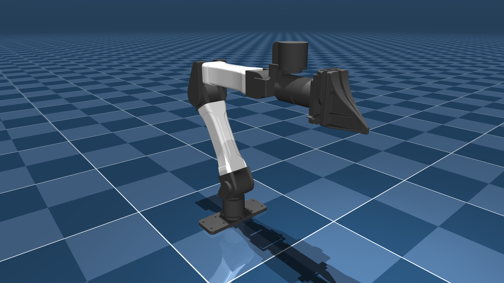

# Yet Another Manipulator (YAM) Description (MJCF)

> [!IMPORTANT]
> Requires MuJoCo 3.1.3 or later.

## Changelog

See [CHANGELOG.md](./CHANGELOG.md) for a full history of changes.

## Overview

This package contains a simplified robot description (MJCF) of the [YAM robot](https://i2rt.com/products/yam-manipulator) developed by [I2
RT Robotics](https://i2rt.com/). It is derived from the [publicly available
URDF
description](https://github.com/i2rt-robotics/i2rt/blob/main/robot_models/yam/yam.urdf).

  

## MJCF derivation steps

1. Started from `yam.urdf` (commit SHA d4efb66d81bd8bde42909880b16591d4af82e8c0).
2. Added the following to the URDF `<robot>` tag `<mujoco><compiler balanceinertia="true" discardvisual="false" fusestatic="false" strippath="false"/></mujoco>`.
3. Loaded the URDF into MuJoCo and saved a corresponding MJCF.
4. Added home keyframe.
5. Added tracking light.
6. Add frictionloss (not identified).
7. Added armature based on reflected inertia values provided by the manufacturer.
8. Switched to implicitfast and used position actuators with kp/kv semantics.

## License

This model is released under an [MIT License](LICENSE).
