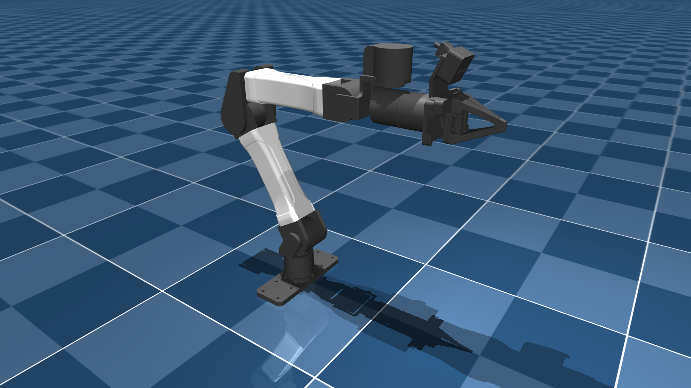

# Yet Another Manipulator (YAM) Description (MJCF)

> [!IMPORTANT]
> Requires MuJoCo 3.2.0 or later.

## Changelog

See [CHANGELOG.md](./CHANGELOG.md) for a full history of changes.

## Overview

This package contains simplified robot descriptions (MJCF) of the [YAM
robot](https://i2rt.com/products/yam-manipulator) developed by [I2RT
Robotics](https://i2rt.com/):

- [`yam.xml`](yam.xml) ([`scene.xml`](scene.xml)): YAM with the `linear_3507`
  gripper, derived from I2RT's [publicly available URDF
  description](https://github.com/i2rt-robotics/i2rt/blob/main/robot_models/yam/yam.urdf).
- [`yam_linear_4310.xml`](yam_linear_4310.xml)
  ([`scene_linear_4310.xml`](scene_linear_4310.xml)): YAM / YAM Pro with the
  `linear_4310` gripper and wrist-mounted Intel RealSense D405 camera on I2RT's
  camera bracket, derived from I2RT's SDK repository
  ([i2rt-robotics/i2rt](https://github.com/i2rt-robotics/i2rt) at tag `v1.3.6`,
  commit `120c3c81400171174604e503943f8d1ebc891058`).

  
  

## MJCF derivation steps (`yam.xml`)

1. Started from `yam.urdf` (commit SHA d4efb66d81bd8bde42909880b16591d4af82e8c0).
2. Added the following to the URDF `<robot>` tag `<mujoco><compiler balanceinertia="true" discardvisual="false" fusestatic="false" strippath="false"/></mujoco>`.
3. Loaded the URDF into MuJoCo and saved a corresponding MJCF.
4. Added home keyframe.
5. Added tracking light.
6. Add frictionloss (not identified).
7. Added armature based on reflected inertia values provided by the manufacturer.
8. Switched to implicitfast and used position actuators with kp/kv semantics.

## `linear_4310` gripper and wrist camera variant (`yam_linear_4310.xml`)

Derived from `yam.xml` and I2RT's SDK repository ([i2rt-robotics/i2rt](https://github.com/i2rt-robotics/i2rt), tag `v1.3.6`):

1. Added meshes for the `linear_4310` gripper and D405 bracket into `assets/linear_4310/`.
2. Updated arm joint ranges and actuator PD gains to match the YAM Pro + `linear_4310` SDK configuration.
3. Replaced the gripper on `link_6` with the `linear_4310` linear gripper:
   - Finger travel is 0 to 47.5 mm, with joint and control limits extending 5 mm past closed to allow grasp squeezing.
   - Actuator PD gains and force limits match the hardware's 50 N per-pad grip force limit.
   - Modeled finger collision geometry using box primitives fitted to the visual meshes, with flat contact pads aligned for parallel grasping.
4. Added the wrist-mounted Intel RealSense D405 camera on `link_6` using extrinsics, intrinsics, and mass properties from I2RT's CAD station model.

## License

This model is released under an [MIT License](LICENSE).
