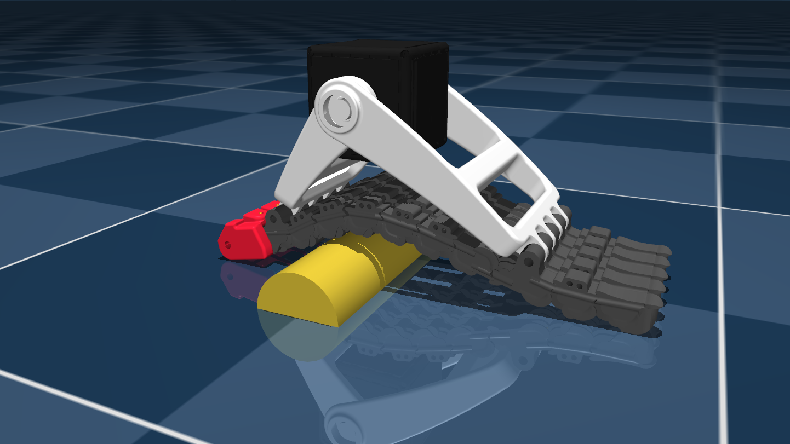

# IIT SoftFoot Description (MJCF)

> [!IMPORTANT]
> Requires MuJoCo 3.2.0 or later.

## Overview

This package is a reproduction of the simplified robot description (MJCF) developed by the by [IIT Soft Robotics for Human Cooperation and Rehabilitation group](https://softbots.iit.it/) for the [Natural Machine Motion Initiative (NMMI)](https://www.naturalmachinemotioninitiative.com/), originally available from the [NMMI repository](https://github.com/NMMI/SoftFoot_MuJoCo). The MJCF and assets are provided under a [BSD-3-Clause License](LICENSE). For more information on the SoftFoot, see the following references:

- [Piazza, C., Della Santina, C., Grioli, G., Bicchi, A. and Catalano, M.G., 2024. Analytical Model and Experimental Testing of the SoftFoot: An Adaptive Robot Foot for Walking Over Obstacles and Irregular Terrains. IEEE Transactions on Robotics.](https://www.doi.org/10.1109/TRO.2024.3415237)
- [Crotti, M., Rossini, L., Pace, A., Grioli, G., Bicchi, A. and Catalano, M.G., 2024. Soft Adaptive Feet for Legged Robots: An Open-Source Model for Locomotion Simulation. arXiv preprint arXiv:2412.03191.](https://arxiv.org/abs/2412.03191)

  

## Usage

The SoftFoot model is intended to be attached as an end effector to a legged robot. This can be achieved through several methods:

- Using the `<attach/>` element in the robot MJCF, and referencing the `attachment_cube` body from the softfoot MJCF. The provided example `scene.xml` uses this method.
- Procedurally attaching it through [`mjSpec`](https://mujoco.readthedocs.io/en/stable/programming/modeledit.html).
- Adding the SoftFoot to the MJCF through the [`mjcf` python module](https://github.com/google-deepmind/dm_control/tree/main/dm_control/mjcf).

## License

This model is released under an [BSD-3-Clause License](LICENSE).

## Publications

If you use this work in an academic context, please cite the following publications:

> Crotti, M., Rossini, L., Hodossy, K. B., Pace, A., Grioli, G., Bicchi, A. and Catalano, M. G.,
> **"Soft Adaptive Feet for Legged Robots: An Open-Source Model for Locomotion Simulation“**,
> in arXiv preprint arXiv:2412.03191, 2024. ([DOI](https://doi.org/10.48550/arXiv.2412.03191))

    @article{anymal2017,
        title={Soft Adaptive Feet for Legged Robots: An Open-Source Model for Locomotion Simulation},
        author={Crotti, Matteo and Rossini, Luca and Hodossy, K. Balint and Pace, Anna and Grioli, Giorgio and Bicchi, Antonio and and Catalano, Manuel G.},
        journal={arXiv},
        volume={},
        number={},
        pages={},
        year={2024},
        publisher={}
        doi = {https://doi.org/10.48550/arXiv.2412.03191}
    }

> Piazza, C., Della Santina, C., Grioli, G., Bicchi, A. and Catalano, M. G.,
> **"Analytical Model and Experimental Testing of the SoftFoot: An Adaptive Robot Foot for Walking Over Obstacles and Irregular Terrains“**,
> in IEEE Transactions on Robotics, 2024. ([DOI](https://www.doi.org/10.1109/TRO.2024.3415237))

    @article{softfoot2024,
        author={Piazza, Cristina and Santina, Cosimo Della and Grioli, Giorgio and Bicchi, Antonio and Catalano, Manuel G.},
        journal={IEEE Transactions on Robotics},
        title={Analytical Model and Experimental Testing of the SoftFoot: An Adaptive Robot Foot for Walking Over Obstacles and Irregular Terrains},
        year={2024},
        volume={40},
        number={},
        pages={3290-3305},
        keywords={Foot;Robots;Legged locomotion;Stability analysis;Robot kinematics;Shape;Humanoid robots;Adaptive foot;humanoid robots;soft robots},
        doi={10.1109/TRO.2024.3415237}
    }
