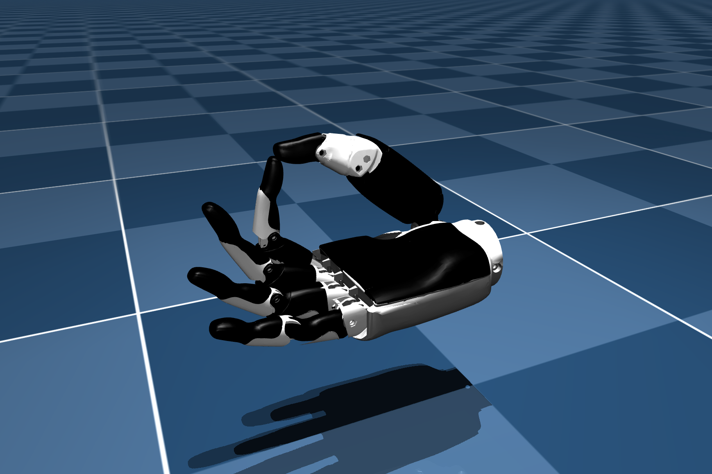

# Inspire Hand RH56DFX Description (MJCF)

> [!IMPORTANT]
> Requires MuJoCo 3.1.6 or later.

## Changelog

See [CHANGELOG.md](./CHANGELOG.md) for a full history of changes.

## Overview

This package contains assets of the "RH56DFX" version of the Inspire Hand (often attached to Unitree G1/H1 Humanoids), including both right-handed and left-handed versions.
The original URDF and assets can be found directly on
[Inspire Hand Company](https://www.inspire-robots.com/).

  

## Modifications Made

1. Used the MJCF files from [ARISE](https://github.com/ARISE-Initiative/robosuite) as a starting base.
2. Broke the .stls into smaller parts using blender.
3. Replaced original .stls with the smaller fragments and colored the meshes to match the real hand. 
4. Manually edited the MJCF to extract common properties into the `<default>` section.
5. Added position-controlled actuators.
6. Added `impratio=10` for better noslip.
7. Added `scene_left.xml` and `scene_right.xml` which include the robot, with
    an object, textured groundplane, skybox, and haze.

## License

This model is released under a [BSD-3-Clause License](LICENSE).
