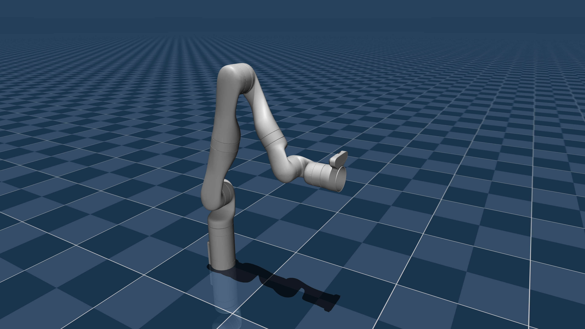

# Kinova Gen3 Description (MJCF)

> [!IMPORTANT]
> Requires MuJoCo 2.3.3 or later.

## Changelog

See [CHANGELOG.md](./CHANGELOG.md) for a full history of changes.

## Overview

This package contains a simplified robot description (MJCF) of the [Kinova
Gen3](https://www.kinovarobotics.com/product/gen3-robots) developed by [Kinova Robotics](https://www.kinovarobotics.com/). It is derived from the [publicly
available URDF description](https://github.com/Kinovarobotics/ros_kortex/blob/noetic-devel/kortex_description/robots/gen3.xacro).

<p float="left">
  
</p>

## MJCF derivation steps

1. Converted xacro to URDF: `rosrun xacro xacro gen3.xacro > gen3.urdf`
2. Added the following to the URDF's `<robot>` clause:

```xml
<mujoco>
  <compiler meshdir="assets" discardvisual="false" fusestatic="false"/>
</mujoco>
```

Note `fusestatic="false"` is needed so that base_link is preserved.

3. Converted to MJCF:

```python
import mujoco
model = mujoco.MjModel.from_xml_path('gen3.urdf')
mujoco.mj_saveLastXML('gen3.xml', model)
```

4. Cleaned up the MJCF file as follows:
    - Added option: `<option integrator="implicitfast"/>`.
    - Replaced `type="mesh" contype="0" conaffinity="0" group="1" density="0" rgba="0.75294 0.75294 0.75294 1"` with `class="visual"` and added the class to defaults.
    - Replaced `type="mesh" rgba="0.75294 0.75294 0.75294 1"` with `class="collision"` and added the class to defaults.
    - Deleted `<body name="end_effector_link">` entirely and replaced with `<site name="pinch_site" pos="0 0 -0.061525" quat="0 1 0 0"/>`.
5. Added the following to the MJCF:
    - Added wrist camera: `<camera name="wrist" pos="0 -0.05639 -0.058475" quat="0 0 0 1" fovy="41.83792730009236" resolution="640 480"/>`.
    - Added position actuators with joint limits on joints 2, 4, and 6.
    - Added keyframes for "home" and "retract".
6. Added `scene.xml` which includes the robot, with a textured groundplane, skybox, and haze.

## Robotiq 2F-85

Do not include the Robotiq mechanical coupling used in arms such as the UR and Franka since for the Kinova Gen3, it is built into the end effector interface. Specifically, if using Menagerie's `robotiq_2f85`, the "base_mount" link (mechanical coupling) should be excluded. Instead, the "base" link should be directly mounted at pose `pos="0 0 -0.06149039" quat="0 -1 1 0"` like so:

```xml
<body name="base" pos="0 0 -0.06149039" quat="0 -1 1 0" childclass="2f85">
  ...
</body>
```

The end effector site should also be shifted by an additional `0.12` to match the behavior of Kinova Kortex API:

```xml
<site name="pinch_site" pos="0 0 -0.181525" quat="0 1 0 0" group="3"/>
```

## License

This model is released under a [BSD-3-Clause License](LICENSE).

## Acknowledgement

This model was graciously contributed by [Jimmy Wu](https://jimmyyhwu.github.io/).
