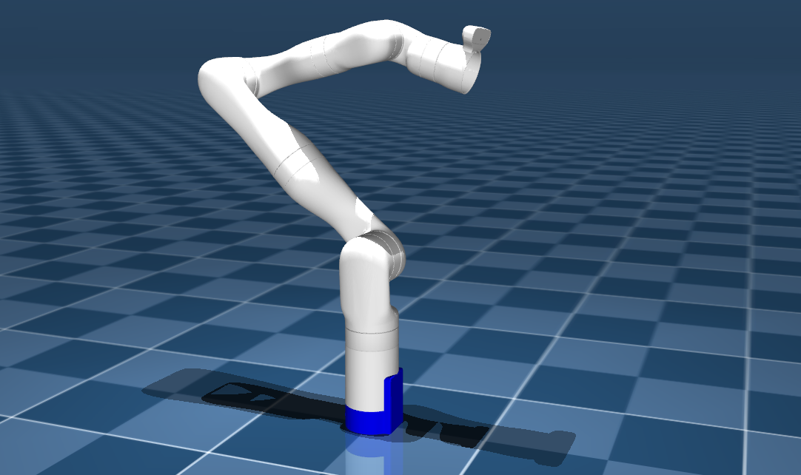

# Kinova Gen3 7 DOF Description (MJCF)

This package contains a simplified robot description (MJCF) of the
[Kinova Gen3 7DoF](https://www.kinovarobotics.com/product/gen3-robots) developed by
[Kinova Robotics](https://www.kinovarobotics.com/). It is derived from the
[publicly available URDF
description](https://github.com/Kinovarobotics/ros2_kortex/tree/main/kortex_description/arms/gen3/7dof).

  

### URDF → MJCF derivation steps
1. Converted the DAE [mesh
   files](https://github.com/Kinovarobotics/ros2_kortex/tree/main/kortex_description/arms/gen3/7dof/meshes)
   to OBJ and STL format using [Blender](https://www.blender.org/).
   * Saved the converted files in the `assets` directory
2. Manually created MJCF file based on Kinova Gen3 7DoF [URDF](https://github.com/Kinovarobotics/ros2_kortex/tree/main/kortex_description/arms/gen3/7dof)
3. Matched mass and inertial values from URDF
    * Used `.stl` files for collision geometry and `.obj` files for visual geometry
4. Manually edited the MJCF to extract common properties into the `<default>` section.
5. Added position-controlled actuators for the arm.
6. Added `<exclude>` clause to prevent collisions between `base_link` and `shoulder_link`
7. Added `scene.xml` which includes the robot with a textured ground plane, headlight, skybox and haze.

## License

This model is released under a [BSD-3-Clause License](LICENSE).
