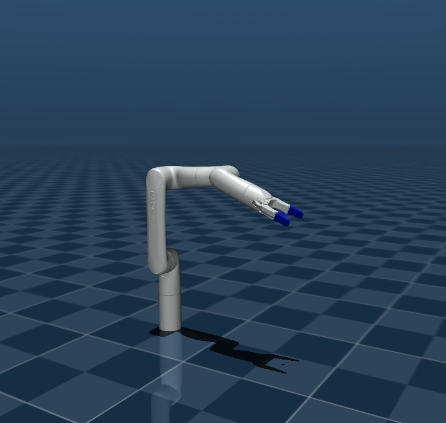

# Kinova Gen3 Lite Description (MJCF)

> [!IMPORTANT]
> Requires MuJoCo 2.3.3 or later.

## Changelog

See [CHANGELOG.md](./CHANGELOG.md) for a full history of changes.

## Overview

This package contains a simplified robot description (MJCF) of the [Kinova
Gen3](https://www.kinovarobotics.com/product/gen3-lite-robots) developed by [Kinova Robotics](https://www.kinovarobotics.com/). It is derived from the [publicly
available URDF description](https://github.com/Kinovarobotics/ros2_kortex/blob/main/kortex_description/robots/gen3_lite.urdf).


<p float="left">
  
</p>


## MJCF derivation steps

1. Converted xacro to URDF: `rosrun xacro xacro gen3_lite.xacro > gen3_lite.urdf`
2. Added the following to the URDF's `<robot>` clause:

```xml
<mujoco>
  <compiler meshdir="assets" discardvisual="false" fusestatic="false"/>
</mujoco>
```

3. Converted to MJCF:

```python
import mujoco
model = mujoco.MjModel.from_xml_path('gen3_lite.urdf')
mujoco.mj_saveLastXML('gen3_lite_raw.xml', model)
```

4. Cleaned up the MJCF file as follows:

   * Added physics options: `<option integrator="implicitfast" cone="pyramidal" impratio="50" tolerance="1e-10" noslip_iterations="8"/>` and `<size nconmax="400" njmax="2000"/>`.
   * Replaced `type="mesh" contype="0" conaffinity="0" group="1" density="0" rgba="0.75294 0.75294 0.75294 1"` with `class="visual"` and added the class to defaults.
   * Replaced bare `type="mesh"` collision geoms with `class="collision"` and added the class to defaults (including `condim="4"`, `solref="0.005 1"`, `solimp="0.9 0.95 0.001"`).
   * Added small global joint damping/armature in `<default>`, plus a `grip_joint` default for the gripper.
   * Standardized mesh filenames to lowercase `.stl` with `<compiler angle="radian" meshdir="assets/"/>`.
   * Added a tool frame and TCP site: `<body name="tool_frame" ...>` with `<site name="ee_site" .../>`.
   * Implemented an underactuated two-finger gripper using `<equality joint ... polycoef="...">` couplings and added near-neighbor contact excludes.
5. Added the following to the MJCF:

   * Position actuators for all six arm joints with per-class gains/limits; a single actuator drives `right_finger_bottom_joint` with the remaining gripper joints coupled.
   * Keyframes for "home", "retract", "open", and "close".
6. Added `scene.xml` which includes the robot.

The end effector site can be shifted by an additional `0.12` along the tool frame to emulate certain Kortex TCP conventions:

```xml
<site name="ee_site" pos="0 0 0.12" quat="0 1 0 0" group="3"/>
```

## License

This model is released under a [BSD-3-Clause License](LICENSE).

## Acknowledgement

This model was graciously contributed by [Anas Houssaini](https://anashoussaini.github.io/), [Abed Al Rahman Al Mrad](https://github.com/aalmrad),[Jonathan Lussier](https://github.com/kinovajon).
