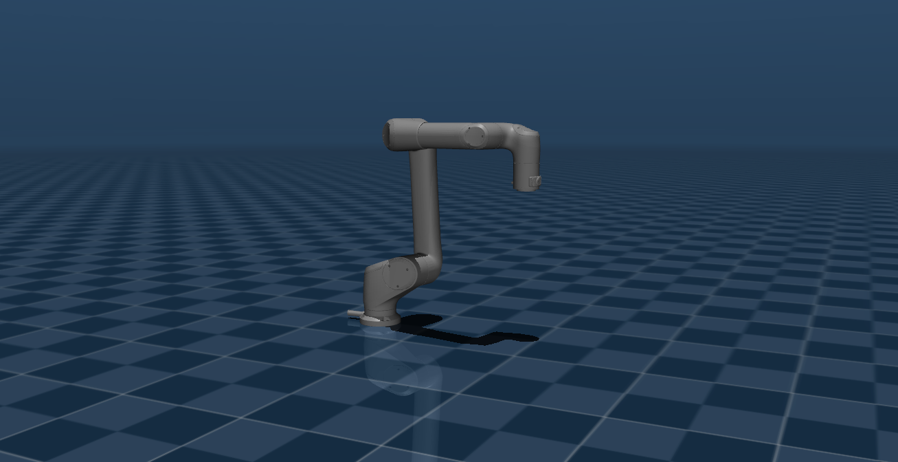

# Kinova Link6 Description (MJCF)

> [!IMPORTANT]
> Requires MuJoCo 2.3.3 or later.

## Changelog

See [CHANGELOG.md](./CHANGELOG.md) for a full history of changes.

## Overview

This package contains a simplified robot description (MJCF) of the [Kinova
Link6](https://www.kinovarobotics.com/product/link6-robots) developed by [Kinova Robotics](https://www.kinovarobotics.com/). It is derived from a private URDF description.


<p float="left">
  
</p>


## MJCF derivation Link6

1. Converted xacro to URDF: `rosrun xacro xacro link6.xacro > link6.urdf`
2. Added the following to the URDF's `<robot>` clause:

```xml
<mujoco>
  <compiler meshdir="assets" discardvisual="false" fusestatic="false"/>
</mujoco>
```

3. Converted to MJCF:

```python
import mujoco
model = mujoco.MjModel.from_xml_path('link6.urdf')
mujoco.mj_saveLastXML('link6_raw.xml', model)
```

4. Added the following to the MJCF:
   * Position actuators for all six arm joints with per-class gains/limits; 
5. Added `scene.xml` which includes the robot.


## License

This model is released under a [BSD-3-Clause License](LICENSE).

## Acknowledgement

This model was graciously contributed by [Anas Houssaini](https://anashoussaini.github.io/), [Abed Al Rahman Al Mrad](https://github.com/aalmrad),[Jonathan Lussier](https://github.com/kinovajon).
