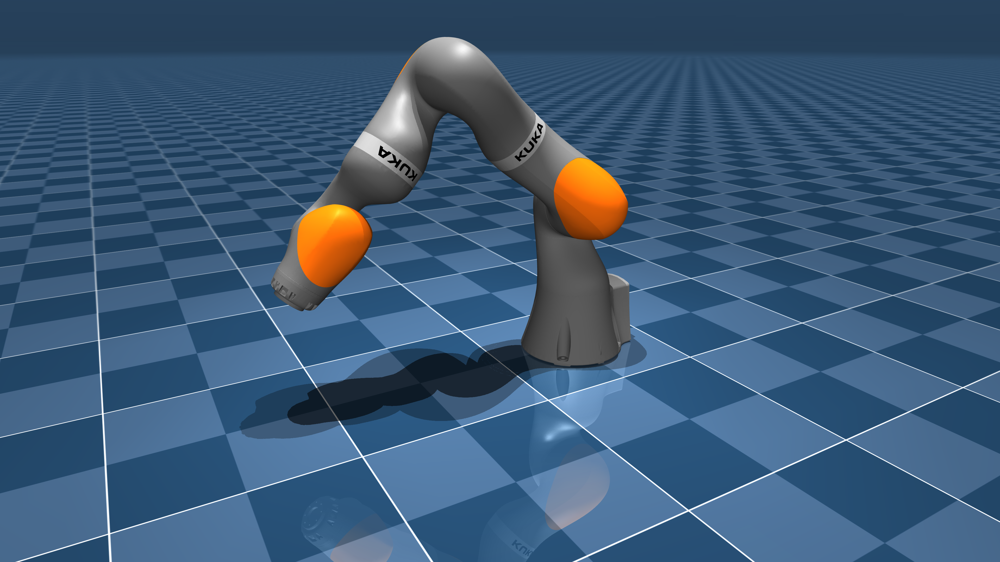

# KUKA LBR iiwa 14 Description (MJCF)

> [!IMPORTANT]
> Requires MuJoCo 2.3.3 or later.

## Changelog

See [CHANGELOG.md](./CHANGELOG.md) for a full history of changes.

## Overview

This package contains a simplified robot description (MJCF) of the [LBR iiwa](https://www.kuka.com/en-us/products/robotics-systems/industrial-robots/lbr-iiwa) 14kg developed
by [KUKA Robotics](https://www.kuka.com/en-us). It is derived from the [publicly available](https://github.com/RobotLocomotion/drake/blob/master/manipulation/models/iiwa_description/urdf/iiwa14_spheres_dense_collision.urdf)
URDF description created by the [Drake](https://github.com/RobotLocomotion/drake) developers.

  

## URDF → MJCF derivation steps

1. Added `<mujoco> <compiler discardvisual="false"/> </mujoco>` to the
   [URDF](https://github.com/RobotLocomotion/drake/blob/master/manipulation/models/iiwa_description/urdf/iiwa14_spheres_dense_collision.urdf)'s
   `<robot>` clause in order to preserve visual geometries.
2. Loaded the URDF into MuJoCo and saved a corresponding MJCF.
3. Created base body and added its corresponding inertial properties.
4. Added a tracking light to the base.
5. Manually edited the MJCF to extract common properties into the `<default>` section.
6.  Added `<exclude>` clauses to prevent collisions between `base` and `link1`.
7.  Added actuators for the arm.
8.  Added forcelimits to match the torque limits in the [spec sheet](https://www.reeco.co.uk/wp-content/uploads/2020/05/KUKA-LBR-iiwa-technical-data.pdf).
9.  Added `scene.xml` which includes the robot, with a textured groundplane, skybox, and haze.

## License

This model is released under a [BSD-3-Clause License](LICENSE).
