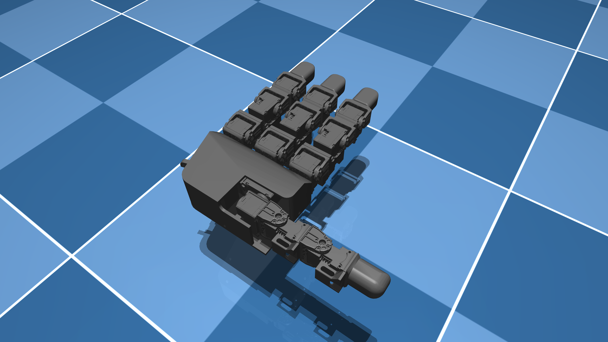

# Leap Hand Description (MJCF)

> [!IMPORTANT]
> Requires MuJoCo 3.1.3 or later.

## Overview

This package contains a simplified robot description (MJCF) of the (left and right) [LEAP Hand](https://leaphand.com/) developed by Carnegie Mellon University. It is derived from the [publicly available URDF description](https://github.com/leap-hand/LEAP_Hand_Sim/blob/master/assets/leap_hand/robot.urdf).

<p float="left">
  
  
</p>

## URDF → MJCF derivation steps

1. Added `<mujoco> <compiler discardvisual="false" strippath="false" fusestatic="false" balanceinertia="true"/> </mujoco>` to the URDF's
   `<robot>` clause in order to preserve visual geometries.
2. Removed `package://` shortcuts in the URDF.
3. Loaded the URDF into MuJoCo and saved a corresponding MJCF.
4. Manually edited the MJCF to extract common properties into the `<default>` section.
5. Added `exclude` clause to prevent collisions between the palm and the base of each finger as well as the mcp and dip joint of each finger.
6. Added position controlled actuators.
7. Added `impratio=10` and `cone=elliptic` for better noslip.
8. Added `scene.xml` which includes the robot, with a textured groundplane, skybox, and haze.

Extra steps taken for the left hand:

- Renamed `palm_lower_left` to `palm_lower`.
- Replaced `thumb_left_temp_base` mesh with `pip` to match the right hand.
- Reordered the joints of the thumb to match that of the right hand.

## License

This model is released under an [MIT License](LICENSE).

## Publications

The LEAP Hand is described in the following publication:

```bibtex
@article{shaw2023leaphand,
    title = {LEAP Hand: Low-Cost, Efficient, and Anthropomorphic Hand for Robot Learning},
    author = {Shaw, Kenneth and Agarwal, Ananye and Pathak, Deepak},
    journal = {Robotics: Science and Systems (RSS)},
    year = {2023}
}
```
