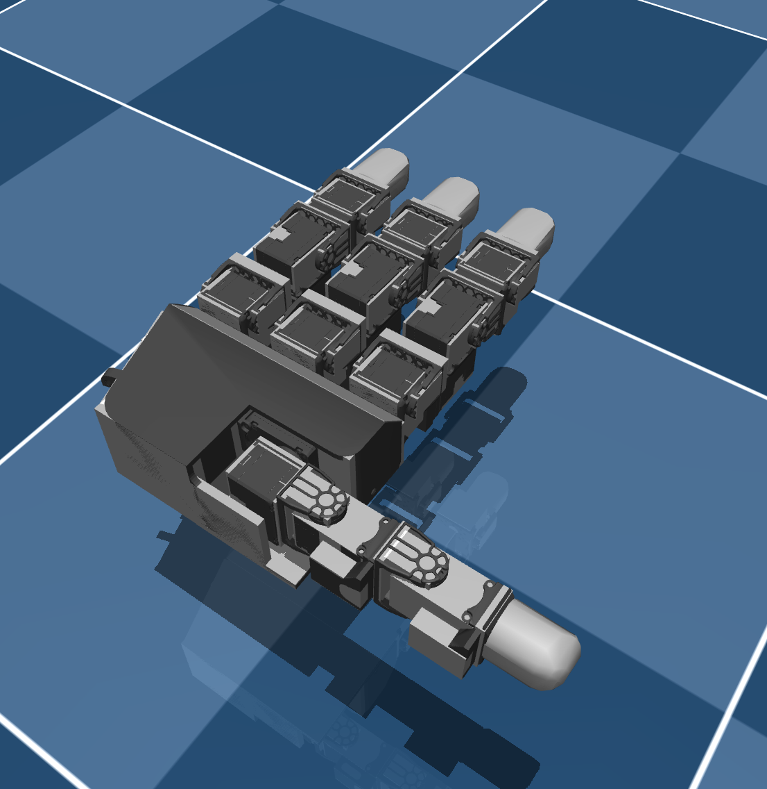

# Leap Hand Description (MJCF)

> [!IMPORTANT]
> Requires MuJoCo 3.1.3 or later.

## Changelog

See [CHANGELOG.md](./CHANGELOG.md) for a full history of changes.

## Overview

This package contains a simplified robot description (MJCF) of the (left and right) [LEAP Hand](https://leaphand.com/) developed by Carnegie Mellon University. It is derived from the [publicly available URDF description](https://github.com/dexsuite/dex-urdf/tree/main/robots/hands/leap_hand).

<p float="left">
  
</p>

## URDF → MJCF derivation steps

### Right Hand
1. Start with the right-handed LEAP hand URDF from [dexsuite (hash: 2ee2f70cfd549857f56ffe13c61fa939f4cb50ba)](https://github.com/dexsuite/dex-urdf/tree/main/robots/hands/leap_hand)
2. Run it through drake's fix_inertia tool (v. 1.30.0)
3. Add the following mujoco block to the urdf under `<robot>`:
    ```
    <mujoco>
      <compiler balanceinertia="true" discardvisual="false" fusestatic="false"/>
    </mujoco>
    ```
4. Open the file in the mujoco viewer using
    ```
    python -m mujoco.viewer --mjcf=<name_of_inertia_fixed_urdf>.urdf
    ```
5. Save the xml out of the viewer by clicking the "Save xml" button. From now on, modifications are referring to the saved xml.
6. Delete the auxiliary body "base" created by not fusing static bodies.
7. Rename bodies and joints according to the following:
    - palm_lower -> palm
    - mcp_joint -> base
    - pip -> proximal
    - dip -> medial
    - fingertip -> distal
    - white_tip -> tip
8. Give names to all geoms according to visual or collision status.
9. Create default classes for joints and assign all joints to their appropriate class.
10. Delete the actuatorfrcrange field for all joints.
11. Add actuators for all the joints.
12. Add collision filters.
13. Create the visual default group + add the material black.
14. Adjust actuator defaults and solref to increase realism of joints.
15. Use the implicitfast integrator, elliptic friction cone, and high impratio.
16. Create a geom class default for fingertips with high friction.
17. Delete unnecessary "tip_head" bodies.
18. Simplify the fingertip meshes using open3d:
    ```
    import open3d as o3d

    mesh = o3d.io.read_triangle_mesh("tip.obj")
    mesh_smp = mesh.simplify_quadric_decimation(target_number_of_triangles=100)
    o3d.io.write_triangle_mesh("tip_smp.obj", mesh_smp)

    mesh = o3d.io.read_triangle_mesh("thumb_tip.obj")
    mesh_smp = mesh.simplify_quadric_decimation(target_number_of_triangles=100)
    o3d.io.write_triangle_mesh("thumb_tip_smp.obj", mesh_smp)
    ```
    Replace the old obj files with the simplified ones.
19. Add sensors for each of the fingers.
20. Change the "pos" field of "thumb_mp_collision" to "-0.0075 -0.0002 -0.011" in
    order to fix incorrect orientation of thumb collision geometry.

### Left Hand
The steps for creating the left hand are mostly the same, except for the following:
- we use the `dexsuite` hash `6eeda17435d46dde5915a16fd37b248bd8bb468e`, because there are edits for making the left handed LEAP URDF more consistent with the right
- there was no correction of the "thumb_mp_collision" field, but the associated visual mesh is different (thumb_mp_left.obj)

### Both Hands
- Added `white` material for fingertips
- Applied `black` material to collision meshes for improved hand appearance

## License

This model is released under an [MIT License](LICENSE).

## Publications

The LEAP Hand is described in the following publication:

```bibtex
@article{shaw2023leaphand,
    title = {LEAP Hand: Low-Cost, Efficient, and Anthropomorphic Hand for Robot Learning},
    author = {Shaw, Kenneth and Agarwal, Ananye and Pathak, Deepak},
    journal = {Robotics: Science and Systems (RSS)},
    year = {2023}
}
```
