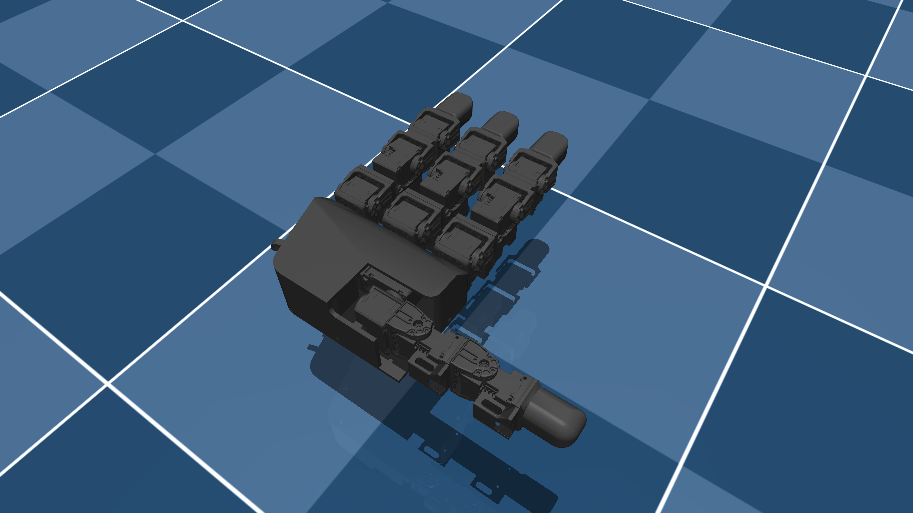

# Leap Hand Description (MJCF)

> [!IMPORTANT]
> Requires MuJoCo 3.1.3 or later.

## Overview

This package contains a simplified robot description (MJCF) of the [LEAP Hand](https://leaphand.com/) developed by Carnegie Mellon University. It is derived from the [publicly available URDF description](https://github.com/leap-hand/LEAP_Hand_Sim/blob/master/assets/leap_hand/robot.urdf).

  

## URDF → MJCF derivation steps

1. Added `<mujoco> <compiler discardvisual="false" strippath="false" fusestatic="false" balanceinertia="true"/> </mujoco>` to the URDF's
   `<robot>` clause in order to preserve visual geometries.
2. Loaded the URDF into MuJoCo and saved a corresponding MJCF.
3. Manually edited the MJCF to extract common properties into the `<default>` section.
4. Added `exclude` clause to prevent collisions between the palm and the base of each finger as well as the mcp and dip joint of each finger.
10. Added position controlled actuators.
11. Added `impratio=10` and `cone=elliptic` for better noslip.
12. Added `scene.xml` which includes the robot, with a textured groundplane, skybox, and haze.

## License

This model is released under an [MIT License](LICENSE).
