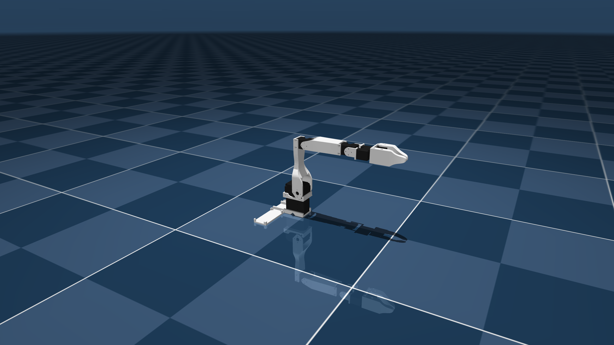

# Low-Cost Robot Arm (MJCF)

> [!IMPORTANT]
> Requires MuJoCo 3.1.6 or later.

## Overview

This package contains a simplified robot description (MJCF) of the **Low-Cost Robot Arm** developed originally by [Alexander Koch](https://github.com/AlexanderKoch-Koch/low_cost_robot/tree/main) and updated by [HuggingFace LeRobot Team](https://github.com/jess-moss/koch-v1-1/tree/main) with the name **Kochv1.1**. It is derived from the [publicly available URDF description](https://github.com/s1lent4gnt/koch-v1-1/blob/main/simulation/follower.urdf).

  

## URDF → MJCF derivation steps

1. Added `<mujoco><compiler discardvisual="false" strippath="false"/></mujoco>` to the URDF’s `<robot>` element to preserve visual geometries.
2. Loaded the URDF into MuJoCo and saved it as a corresponding MJCF.
3. Manually edited the MJCF to extract shared properties into the `<default>` section.
4. Edited original meshes: extracted servos into separate files, manually created convex collision meshes for the gripper fingers using [obj2mjcf](https://github.com/kevinzakka/obj2mjcf/tree/main).
5. Added extra box-shaped collision geoms to the gripper fingers tip for additional contact points.
6. Added an `exclude` clause to prevent collisions between `base_link` and `shoulder_rotation`.
7. Added approximate joint limits.
8. Added position-controlled actuators.
9. Added `impratio="10"` and `cone="elliptic"` attributes for improved no-slip behavior.
10. Created `scene.xml` to include the robot, along with a textured ground plane, skybox, and haze.

## License

This model is released under an [Apache-2.0 License](LICENSE).
