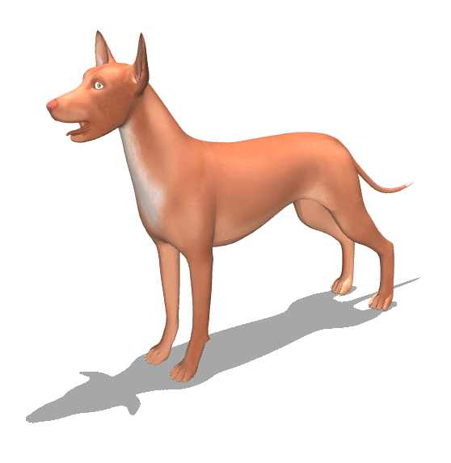
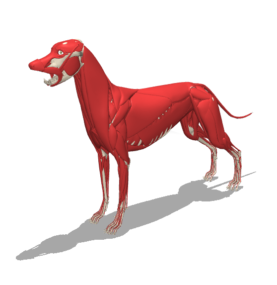
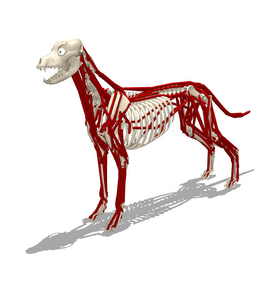
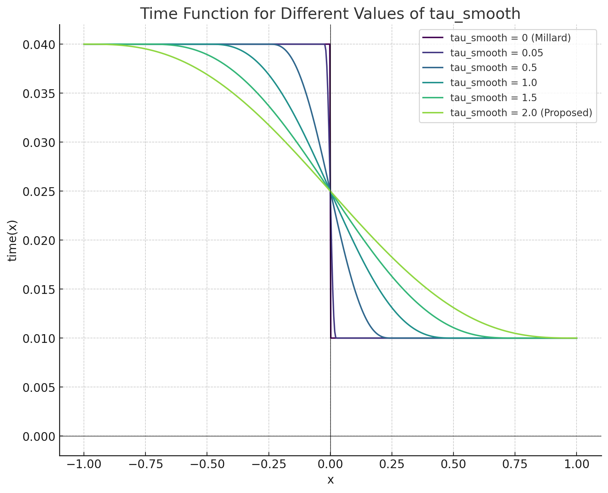

## Overview

This package contains a musculoskeletal model of a dog developed by ..

  
  
  

The package contains two model with the same muscle routing but different dynamics to compute activation/deactivation times, as shown in the following picture: 

  

## License

These models are released under a [Apache License](LICENSE).
