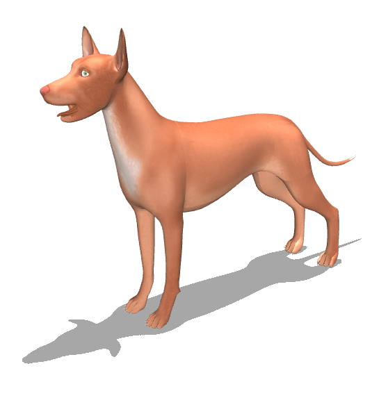
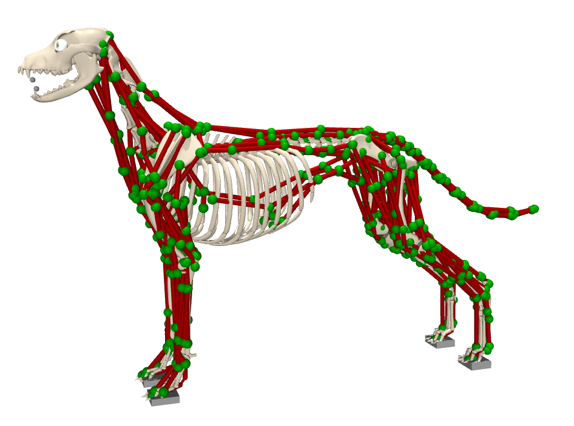
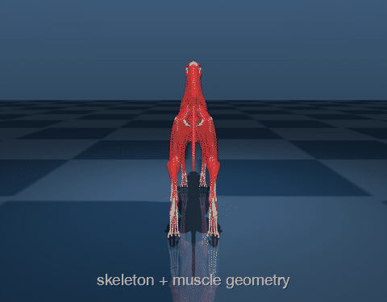

# Musculoskeletal Dog Description (MJCF)

## Changelog

See [CHANGELOG.md](./CHANGELOG.md) for a full history of changes.

## Overview

This package contains a parametric musculoskeletal model description (MJCF) of a dog, developed by
[Vittorio La Barbera](https://github.com/vittorione94) et al. It is adapted from the
[Musculoskeletal Dog repository], which remains the source of truth for the latest version of the
model.

The skeleton is built from 163 bone meshes and has 73 hinge joints across the limbs, spine, neck,
tail and jaw, plus a free joint at the root (79 DoF in total). The muscle variants replace the 38
joint torque actuators with 127 Hill-type muscles routed over sites and wrapping objects, each
rendered with its own deformable skin.

<p float="left">
  
  
  
  
</p>

<p float="left">
  
</p>

The package includes three model variants:

| Model                                                | Scene                                                    | Actuation                                        |
| ---------------------------------------------------- | -------------------------------------------------------- | ------------------------------------------------ |
| [dog.xml](./dog.xml)                                 | [scene.xml](./scene.xml)                                 | 38 torque actuators                              |
| [dog_muscles_Millard.xml](./dog_muscles_Millard.xml) | [scene_muscles_Millard.xml](./scene_muscles_Millard.xml) | 127 muscles, Millard activation dynamics         |
| [dog_muscles_Sigmoid.xml](./dog_muscles_Sigmoid.xml) | [scene_muscles_Sigmoid.xml](./scene_muscles_Sigmoid.xml) | 127 muscles, smoothed (sigmoid) activation dynamics |

The two muscle variants share the same anatomy and differ only in the activation/deactivation
dynamics: the Millard variant uses MuJoCo's default switching muscle dynamics (`dynprm[2] = 0`),
while the sigmoid variant smooths the switch (`dynprm[2] = 2`), which makes the model differentiable
and better behaved under gradient-based control.

Tested with MuJoCo 3.12.0.

## MJCF derivation steps

1. Started from the MJCF and asset files provided in the [Musculoskeletal Dog repository].
2. Flattened the `models/` + `assets/` split into the Menagerie layout, rewriting mesh, skin and
   texture references from `../assets/...` to `assets/...`.
3. Formatted all XML files with the repository's [`format_xml.py`](../format_xml.py).

Asset paths are given relative to each model file rather than through `meshdir`/`texturedir`, so the
models can be `<include>`d from a scene living anywhere on disk, including one that declares its own
`meshdir`.

```
musculoskeletal_dog/
├── dog.xml, dog_muscles_*.xml, scene*.xml
└── assets/
    ├── meshes/    # bone meshes (STL)
    ├── skins/     # body and muscle skins (SKN)
    └── textures/
```

## License

This model is released under an [MIT License](LICENSE).

## Citation

If you use this work in an academic context, please cite the following publication:

```bibtex
@article{labarbera2025motion,
  title   = {Motion Tracking with Muscles: Predictive Control of a Parametric
             Musculoskeletal Canine Model},
  author  = {La Barbera, Vittorio and Bohez, Steven and Hasenclever, Leonard and
             Tassa, Yuval and Hutchinson, John R.},
  journal = {arXiv preprint arXiv:2506.23768},
  year    = {2025},
  url     = {https://arxiv.org/abs/2506.23768}
}
```

[Musculoskeletal Dog repository]: https://github.com/vittorione94/MusculoskeletalDog
