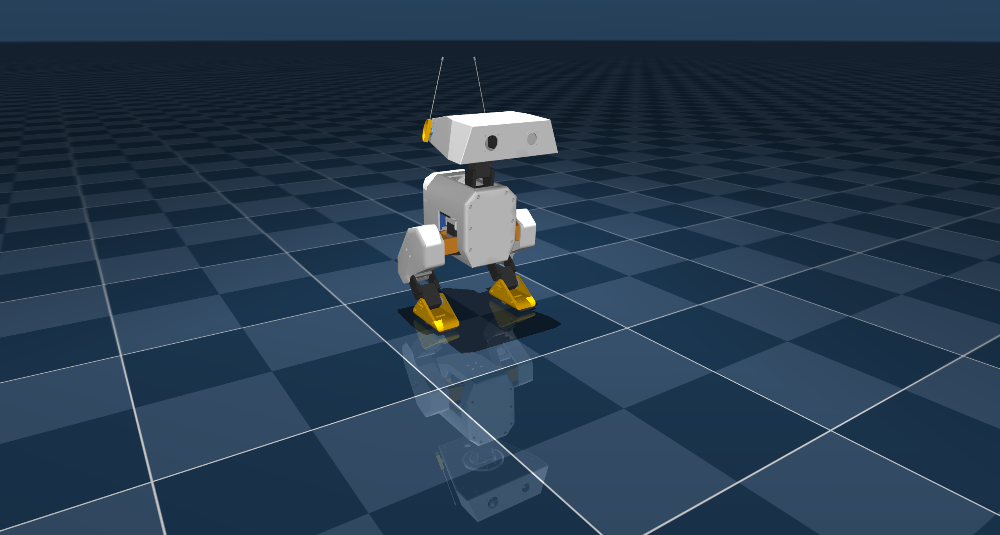

# Open Duck Mini V2

## Overview

This package contains the [Open Duck Mini v2](https://github.com/apirrone/Open_Duck_Mini) robot description (MJCF)

  

## System identification 

The motors were identified using Rhoban's [BAM](https://github.com/Rhoban/bam/)

## License 

This model is under a [Apache 2.0 License](LICENSE)