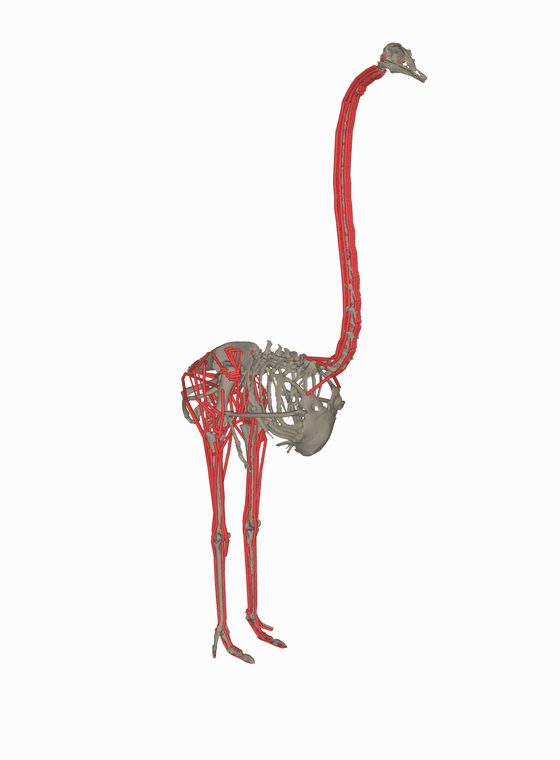

# Ostrich Description (MJCF)

## Changelog

See [CHANGELOG.md](./CHANGELOG.md) for a full history of changes.

## Overview

This package contains a musculoskeletal model description (MJCF) of an ostrich
(_Struthio camelus_), adapted from the [OstrichRL] repository, which remains the
source of truth for the latest version of the model. The model is derived from
a CT scan of a real ostrich and was built to study bio-mechanical locomotion
with muscle-actuated reinforcement learning.

The package includes three model variants:

* [ostrich.xml](./ostrich.xml): full body, actuated by 120 muscles (68 in the
  legs, 52 in the neck).
* [ostrich_legs_torque.xml](./ostrich_legs_torque.xml): legs-and-torso variant
  driven by 12 joint torque motors instead of muscles, with the neck removed.
* [ostrich_neck.xml](./ostrich_neck.xml): neck-only variant, fixed to the world
  at the torso and actuated by the 52 neck muscles. Includes the target and
  region sites used by the OstrichRL foraging task.

Viewer-ready scene files are also provided:

* [scene.xml](./scene.xml)
* [scene_legs_torque.xml](./scene_legs_torque.xml)
* [scene_neck.xml](./scene_neck.xml)

<p float="left">
  
</p>

The animation above is rendered with the repo-level
[`render_orbit_gif.py`](../render_orbit_gif.py):

```bash
uv run render_orbit_gif.py ostrich/ostrich.xml --output ostrich/ostrich.gif \
    --width 560 --height 760 --start_azimuth 135
```

## Model notes

* The body is attached to the world by six explicit 1-DoF joints (`root_x`,
  `root_y`, `root_z`, `root_rot_x`, `root_rot_y`, `root_rot_z`) rather than a
  `<freejoint>`. This is preserved from the upstream model so that the OstrichRL
  tasks and the motion capture data shipped with them remain directly usable.
* Muscle actuators use `ctrlrange="-1 1"`, matching upstream.
* The default pose (`qpos0`) is a standing pose with both feet resting on the
  floor, so no `home` keyframe is provided. The model is muscle-actuated and
  will collapse under zero control — it is not passively stable.
* Muscle wrapping surfaces are in geom group 5 and are hidden by default in the
  viewer.

## MJCF derivation steps

1. Started from the MJCF and mesh files provided in the [OstrichRL] repository.
2. Moved the meshes and the bone/tendon/actuator XML components under
   [`assets/`](./assets/) and inlined the contents of the upstream `shared.xml`
   into each model file.
3. Moved the floor, skybox, and lighting out of the model files into the
   `scene*.xml` files, keeping the original floor friction and contact solver
   parameters.
4. Wrapped the geom defaults in an `ostrich` default class applied via
   `childclass`, so that geoms defined in a scene are not affected by the
   model's defaults.
5. Removed the deprecated `<size njmax nconmax>` limits (MuJoCo now sizes the
   contact arena dynamically).
6. Set the stiffness of the six root joints to zero in
   `ostrich_legs_torque.xml`. Upstream, these joints inherited the default joint
   stiffness of 10, which acts as a spring pulling the ostrich back to the
   origin; `ostrich.xml` already zeroed them.
7. Added `scene*.xml` files so the models can be loaded directly in the MuJoCo
   viewer.

Apart from step 6, the compiled models are numerically identical to the
upstream ones (same bodies, geoms, sites, tendons, actuators, inertias, and
simulation trajectories).

## License

This model is released under an [MIT License](LICENSE).

## Citation

If you use this work in an academic context, please cite the following publication:

```bibtex
@inproceedings{labarbera2022ostrichrl,
  title={OstrichRL: A Musculoskeletal Ostrich Simulation to Study Bio-mechanical Locomotion},
  author={La Barbera, Vittorio and Pardo, Fabio and Tassa, Yuval and Daley, Monica and Richards, Christopher and Kormushev, Petar and Hutchinson, John},
  booktitle={Proceedings of the Workshop on Deep Reinforcement Learning at NeurIPS},
  year={2021}
}
```

[OstrichRL]: https://github.com/vittorione94/ostrichrl
