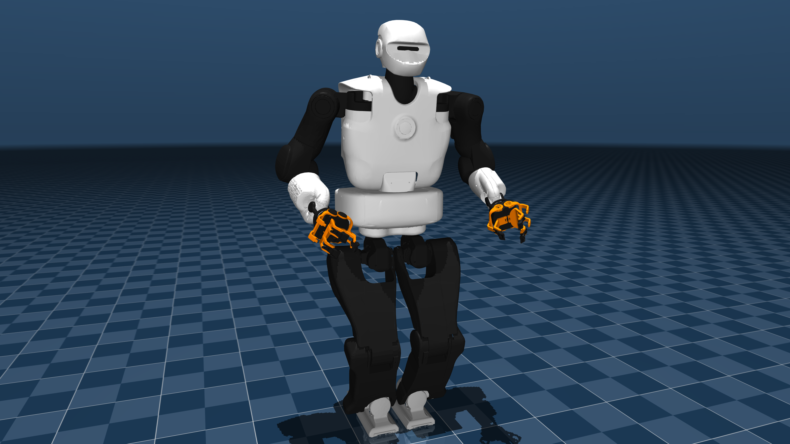

## TALOS Description (MJCF)

> [!IMPORTANT]
> Requires MuJoCo 2.2.2 or later.

## Changelog

See [CHANGELOG.md](./CHANGELOG.md) for a full history of changes.

### Overview

This package contains a simplified robot description (MJCF) of the [TALOS Robot](https://pal-robotics.com/robots/talos/) by [PAL Robotics](https://pal-robotics.com/). It is derived from the publicly available [URDF description](https://github.com/pal-robotics/talos_robot/tree/kinetic-devel/talos_description).

  

### URDF -> MJCF derivation step

 1. Converted the .DAE meshes to .STL format
 2. Added `<mujoco> <compiler meshdir="../meshes/" strippath="false" balanceinertia="true" autolimits="true" discardvisual="false"/> </mujoco>` to the URDF in order to preserve visual geometries and configure other [parameters](https://mujoco.readthedocs.io/en/stable/XMLreference.html#compiler).
 3. Removed `package://` shortcuts and fixed file paths to use assets only from the local `assets` folder.
 4. Used the MuJoCo compiler with `compile` command to convert the URDF file to MJCF format.
 5. Added a free joint `<joint name="reference" type="free"/>` to the base and fixed the body tree by adding `<body  name="base_link"  pos="0 0 0"></body>` around the base geom.
 6. Added `<inertial pos="-0.05709419 0.00153054 -0.0762521" mass="15.36284" fullinertia="0.20105075811 0.08411496729 0.2318908414 0.00023244734 0.0040167728 -0.00087206649"/> <geom type="mesh" class="visual" density="0" rgba="0.9 0.9 0.9 1" mesh="base_link"/>` base inertia that was not automatically converted.
 7. Added force, velocity and position controlled actuators.
 8. Added `home` keyframe.
 9. Added visuals improvements: plane, skybox and light.
 10. Added contact `<exclude>` to prevent unwanted collisions between some of the bodies.
 11. Added `scene.xml` which includes the robot, with a textured groundplane, skybox, and haze.

### License

This model is released under an [Apache-2.0 License](LICENSE).
