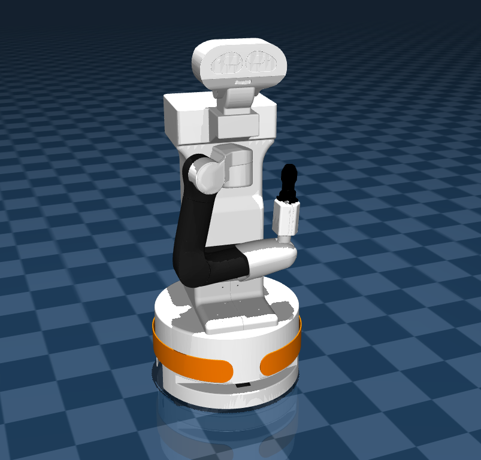

## Tiago Description (MJCF)
Requires MuJoCo 2.2.2 or later.

### Overiew

This package contains a simplified robot description (MJCF) of the [Tiago Robot](https://pal-robotics.com/robots/tiago/) by [PAL Robotics](https://pal-robotics.com/). It is derived from the publicy available [URDF description](https://github.com/pal-robotics/tiago_robot/blob/kinetic-devel/tiago_description/robots/tiago.urdf.xacro). 

  

### URDF -> MJCF derivation steps

 1. Converted the .DAE meshes to .STL format
 2.  Added   `<mujoco>  <compiler meshdir="../meshes/" strippath="false"balanceinertia="true" 		autolimits="true" discardvisual="false"/> </mujoco>` to the URDF in order to preserve visual geometries and configure other [parameters](https://mujoco.readthedocs.io/en/stable/XMLreference.html#compiler).
 3.  Removed all `<collision>` elements in the URDF that created a bug with geometries.
 4. Removed `package://` shortcuts and fixed file paths to use assets only from the local `assets` folder. 
 5.  Used the MuJoCo compiler with `compile` command to convert the URDF file to MJCF  format.
 6. Added a free joint `<joint  name="reference"  type="free"/>` to the base and fixed the body tree by adding `<body  name="base_link"  pos="0 0 0"></body>` around the base geom.
 7. Added `<inertial  pos="0 0 0"  mass="28.26649"  fullinertia="0.465408937 0.483193291 0.550939703 0.002160024 -0.001760255 -0.000655952"/>` base inertia that was not automatically converted.
 8. Added force, velocity and position controlled actuators (manually) .
 9. Added `home` keyframe
 10. Added visuals improvements: plane, skybox and light. 
 11.  Added contact `<exclude>` to prevent unwanted collisions between some of the bodies.
 12. Added `scene.xml` which includes the robot, with a textured groundplane, skybox, and haze.

### License
