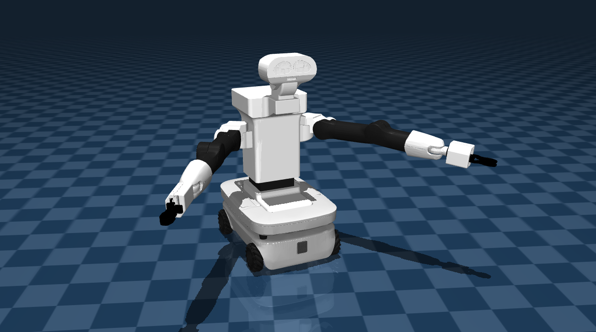

## TIAGo++ Description (MJCF)

> [!IMPORTANT]
> Requires MuJoCo 2.2.2 or later.

## Changelog

See [CHANGELOG.md](./CHANGELOG.md) for a full history of changes.

### Overview

This package contains a simplified robot description (MJCF) of the [TIAGo++ Robot](https://pal-robotics.com/robots/tiago/) with omnidirectional base by [PAL Robotics](https://pal-robotics.com/). It is derived from the publicly available [URDF description](https://github.com/pal-robotics/tiago_dual_robot/blob/kinetic-devel/tiago_dual_description/).

  

### URDF -> MJCF derivation steps

 1. Converted the .DAE meshes to .STL format
 2. Added `<mujoco><compiler meshdir="../meshes/" strippath="false"balanceinertia="true" autolimits="true" discardvisual="false"/></mujoco>` to the URDF in order to preserve visual geometries and configure other [parameters](https://mujoco.readthedocs.io/en/stable/XMLreference.html#compiler).
 3. Removed all `<collision>` elements in the URDF that created a bug with geometries.
 4. Removed `package://` shortcuts and fixed file paths to use assets only from the local `assets` folder.
 5. Used the MuJoCo compiler with `compile` command to convert the URDF file to MJCF  format.
 6. Added a free joint `<joint name="reference" type="free"/>` to the base and fixed the body tree by adding `<body  name="base_link" pos="0 0 0"></body>` around the base geom.
 7. Added `<inertial pos="0 0 0" mass="28.26649" fullinertia="0.465408937 0.483193291 0.550939703 0.002160024 -0.001760255 -0.000655952"/>` base inertia that was not automatically converted.
 8. Added force, velocity and position controlled actuators (manually) .
 9. Added visuals improvements: plane, skybox and light.
 10. Added `scene_position.xml`, `scene_velocity.xml` and `scene_motor.xml` which allows to control the both arms of the robot in different control modes and which also includes the robot, with a textured groundplane, skybox, and haze.

### License

This model is released under an [Apache-2.0 License](LICENSE).
