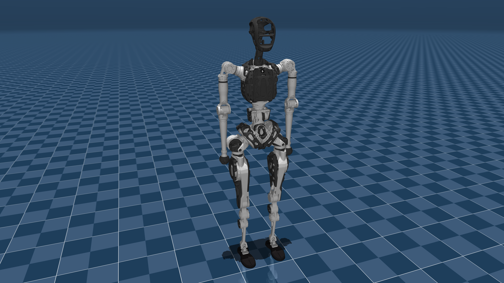

# PNDbotics Adam_lite Description (MJCF)

Requires MuJoCo 2.3.3 or later.

## Overview

This package contains a simplified robot description (MJCF) of the
[Adam_lite humanoid robot](https://www.pndbotics.com/humanoid) developed by [PNDbotics](https://www.pndbotics.com/about).

  

## URDF → MJCF derivation steps

1. Converted the DAE [mesh
   files](https://github.com/RethinkRobotics/sawyer_robot/tree/master/sawyer_description/meshes)
   to OBJ format using [Maya](https://www.autodesk.com/sg/products/maya/overview?term=1-YEAR&tab=subscription).
2. Processed `.obj` files with [`obj2mjcf`](https://github.com/kevinzakka/obj2mjcf).
3. Added `<mujoco> <compiler discardvisual="false"/> </mujoco>` to the
   URDF`<robot>` clause in order to preserve visual geometries.
4. Loaded the URDF into MuJoCo and saved a corresponding MJCF.
5. Manually edited the MJCF to extract common properties into the `<default>` section.
6. Manually designed collision geometries.
7. Added `scene.xml` which includes the robot, with a textured groundplane, skybox, and haze.

## License

This model is released under an [MIT License](LICENSE).
