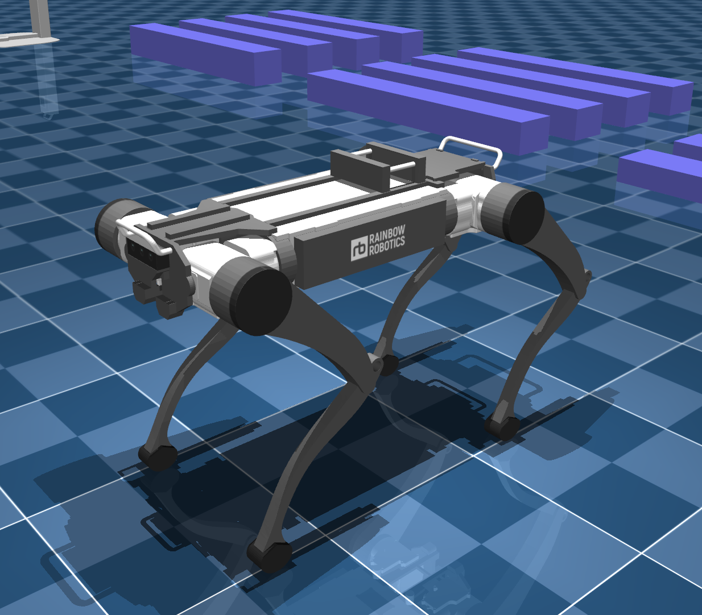

# Rainbow Robotics RBQ-10 Description (MJCF)

> [!IMPORTANT]
> Requires MuJoCo 2.2.2 or later.

## Overview

This package contains a MuJoCo MJCF model of the **RBQ-10** quadruped robot by
[Rainbow Robotics RBQ10](https://rainbowrobotics.github.io/RBQ/).

<span style="color:#c9a227; font-weight:700;">You can also try Rainbow's RBQ software package in MuJoCo through their manual site.</span>
[Maunual RBQ](https://rainbowrobotics.github.io/RBQ/software/developers-guide.html).

<p float="left">
  
</p>

The model includes:

- twelve actuated leg joints (abduction, hip, knee per leg) with torque-limited motors
- approximate trunk and leg visuals with collision primitives
- multiple body-fixed cameras and an IMU site with common sensors (`framequat`, `gyro`, `accelerometer`, etc.)
- a free-floating base (`freejoint` on `base_link`)

## Files in this folder

| File | Description |
| --- | --- |
| `rbq.xml` | Robot definition (compiler defaults, assets, bodies, actuators, sensors). |
| `scene.xml` | Loads `rbq.xml` and adds ground plane, skybox, lighting, and camera framing hints. |
| `LICENSE` | Apache License 2.0 (see below). |
| `assets/` | OBJ meshes and PNG skins (`*_skin.png`) referenced by `rbq.xml`. |

### Recommended usage

Open `scene.xml` in MuJoCo rather than `rbq.xml` alone, so the environment (floor, sky, lights) is included.

### Assets

All mesh and texture `file="..."` paths in `rbq.xml` point under **`assets/`** (for example `assets/trunk.obj`, `assets/trunk_skin.png`). Keep those files next to the MJCF or update the paths if you relocate them.

## Simulation notes

- Actuator limits and dynamics parameters are **simulation-oriented** and may differ from production RBQ-10 hardware and controllers.
- The default `timestep` is set in `rbq.xml` (`0.001` s) with `RK4` integration.

## License

This model is released under the [Apache License 2.0](LICENSE), consistent with other Rainbow Robotics entries in this collection (for example `rainbow_robotics_rby1`).

**Important:** Do **not** use the previous ANYbotics BSD text that was mistakenly placed here—that applied to a different vendor and robot. Redistribution of this RBQ package should follow the Apache 2.0 terms in `LICENSE` (retain copyright and license notices, include `LICENSE` in distributions, etc.).

## Publications

If you use this model in academic work, cite Rainbow Robotics / RBQ-10 documentation or papers your project relies on. Example BibTeX (adjust year/details to match the official reference you use):

```bibtex
@misc{RBQ10_MJCF,
  title        = {RBQ-10 MuJoCo MJCF model (Menagerie)},
  author       = {{Rainbow Robotics}},
  howpublished = {\url{https://www.rainbow-robotics.com/en_main?_l=en}},
  note         = {Simulation model; verify hardware specs against vendor documentation},
}
```
