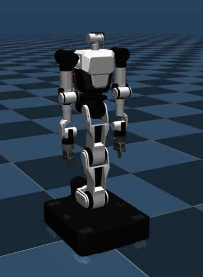

# Rainbow Robotics RBY1 Description (MJCF)

> [!IMPORTANT]
> Requires MuJoCo 3.1.3 or later.

## Overview

This package contains a simplified robot description (MJCF) of the [RBY1](https://rainbowrobotics.github.io/rby1-dev/) developed by [Rainbow Robotics](https://www.rainbow-robotics.com/en_main?_l=en). It is derived from the [publicly
available MJCF description](https://github.com/RainbowRobotics).

<p float="left">
  
</p>

## MJCF derivation steps

**1. 3D Model / Mesh Preprocessing**

- For each part of the robot (body, joints, wheels, gripper, etc.), you can use tools like [`obj2mjcf`](https://github.com/kevinzakka/obj2mjcf) to convert *.obj or other 3D formats into MJCF if necessary.
- In this example, the meshes and assets.xml files have already been properly preprocessed.
- We also provide the `URDF` file for `RBY1`. Please refer to the [URDF](https://github.com/RainbowRobotics/rby1-sdk/blob/main/models/rby1a/urdf/model.urdf) for more details.

**2. Basic MJCF Modifications**

- Review the MJCF file (either exported from MuJoCo or manually created) and adjust `<default>`, `<actuator>`, `<joint>`, etc., to match the robot’s structure.
- In RBY1's case:
  - ``rby1.xml``
    - Defines the robot’s base structure (body, joints, mesh assets).
    - Refines control ranges with position/velocity actuators.
- Exported From MuJoCo
   - Added `<mujoco> <compiler discardvisual="false"/> </mujoco>` to the URDF's `<robot>` clause.
   - Loaded the [URDF](https://github.com/RainbowRobotics/rby1-sdk/blob/main/models/rby1a/urdf/model.urdf) into MuJoCo and saved a corresponding MJCF.
   - Use the previously preprocessed meshes to replace the visual and collision geometry.

**3. Free Joint and Collision Exclusion**
- To allow the robot to move freely in 3D, ensure a free joint (e.g., `world_j type="free"`) is added to the base. (In `rby1.xml`, `joint name="world_j" type="free"`)
- Prevent unwanted self-collisions using `group` attributes and `class="in-model-collision"` to organize collision groups.
- This example uses `<default class="collision">` and `<default class="in-model-collision">` to reduce overhead and avoid undesired collisions.
- If self-collision is desired, users should modify `contype` and `conaffinity` attributes appropriately. For more details, refer to the [MuJoCo XML Reference](https://mujoco.readthedocs.io/en/stable/XMLreference.html).

**4. Note**
- `default` in `rby1.xml`
  - The actuator parameters(`joint`, `motor`, `velocity`, `position`) in simulation may differ from those in an actual robot.

## License

This model is released under a [Apache License 2.0](LICENSE).

## Publications

If you use this model in your work, please use the following citation:

```bibtex
@software{RBY1_2024,
    title = {RBY1: Dual-Arm Mobile Manipulator},
    url = {https://rainbowrobotics.github.io/rby1-dev/},
    author = {RBY1 Team},
    year = {2024},
}
```
