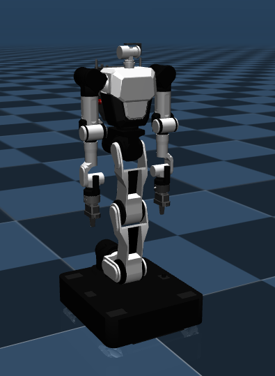

# Rainbow Robotics RBY1 Description (MJCF)

## Overview

This package contains MuJoCo MJCF models for [RBY1](https://rainbowrobotics.github.io/rby1-dev/) by
[Rainbow Robotics](https://www.rainbow-robotics.com/en_main?_l=en), including:
- `RBY1-A` base (`1.2`)
- `RBY1-M` base (`1.2`, `1.3`)
- full gripper and `no_gripper` variants

<p float="left">
  
</p>

## Files in this folder

### Robot model files (`rby1*.xml`)

| File | Description | `<joint name=...>` count | Actuator count |
| --- | --- | ---: | ---: |
| `rby1a_1.2.xml` | RBY1-A (`a_base_*`) with 2 wheel joints (`left_wheel`, `right_wheel`) and grippers | 31 | 26 |
| `rby1a_1.2_no_gripper.xml` | RBY1-A without gripper links/joints/actuators | 25 | 24 |
| `rby1m_1.2.xml` | RBY1-M (`m_base_*`) with 4 mecanum wheel joints (`wheel_fr/fl/rr/rl`) and grippers | 33 | 28 |
| `rby1m_1.2_no_gripper.xml` | RBY1-M without gripper links/joints/actuators | 27 | 26 |
| `rby1m_1.3.xml` | RBY1-M v1.3 (updated wrist/EE meshes: `LINK_11/12/13/18/19/20_V1.3`, `EE_GR_TF`) | 33 | 28 |

Notes:
- All robot files use a free base joint: `joint name="world_j" type="free"`.
- Gripper variants include finger coupling in `<equality>` for mirrored finger motion.
- `no_gripper` variants remove gripper joints/actuators and do not include gripper equality constraints.

### Scene files (`scene_*.xml`)

| File | Includes | Purpose |
| --- | --- | --- |
| `scene_rby1a_1.2.xml` | `rby1a_1.2.xml` | Recommended entry for RBY1-A with grippers |
| `scene_rby1a_1.2_no_gripper.xml` | `rby1a_1.2_no_gripper.xml` | Recommended entry for RBY1-A without grippers |
| `scene_rby1m_1.2.xml` | `rby1m_1.2.xml` | Recommended entry for RBY1-M v1.2 with grippers |
| `scene_rby1m_1.2_no_gripper.xml` | `rby1m_1.2_no_gripper.xml` | Recommended entry for RBY1-M v1.2 without grippers |
| `scene_rby1m_1.3.xml` | `rby1m_1.3.xml` | Recommended entry for RBY1-M v1.3 with grippers |

Each scene file provides:
- simulation options (`timestep=0.002`, Newton solver, `implicitfast`)
- skybox and ground plane
- light source
- default classes used by robot geoms (`visual`, `collision`, `in-model-collision`)

## Recommended usage

Open one of the `scene_*.xml` files in MuJoCo (instead of opening `rby1*.xml` directly), because class defaults and environment setup are defined in the scene file.

## MJCF derivation summary

These models were derived from Rainbow Robotics public resources (including the
[RBY1 URDF](https://github.com/RainbowRobotics/rby1-sdk/blob/main/models/rby1a/urdf/model.urdf))
and then edited for MuJoCo usage:
- converted/preprocessed meshes for MJCF use
- configured wheel/torso/arm/head/gripper actuators and control ranges
- added collision exclusions and in-model collision grouping
- added scene wrappers with environment and simulation defaults

Actuator values in this package are simulation-oriented and may differ from real hardware settings.

## License

This model is released under an [Apache License 2.0](LICENSE.txt).

## Publications

If you use this model in your work, please cite:

```bibtex
@software{RBY1_2024,
    title = {RBY1: Dual-Arm Mobile Manipulator},
    url = {https://rainbowrobotics.github.io/rby1-dev/},
    author = {RBY1 Team},
    year = {2024},
}
```
