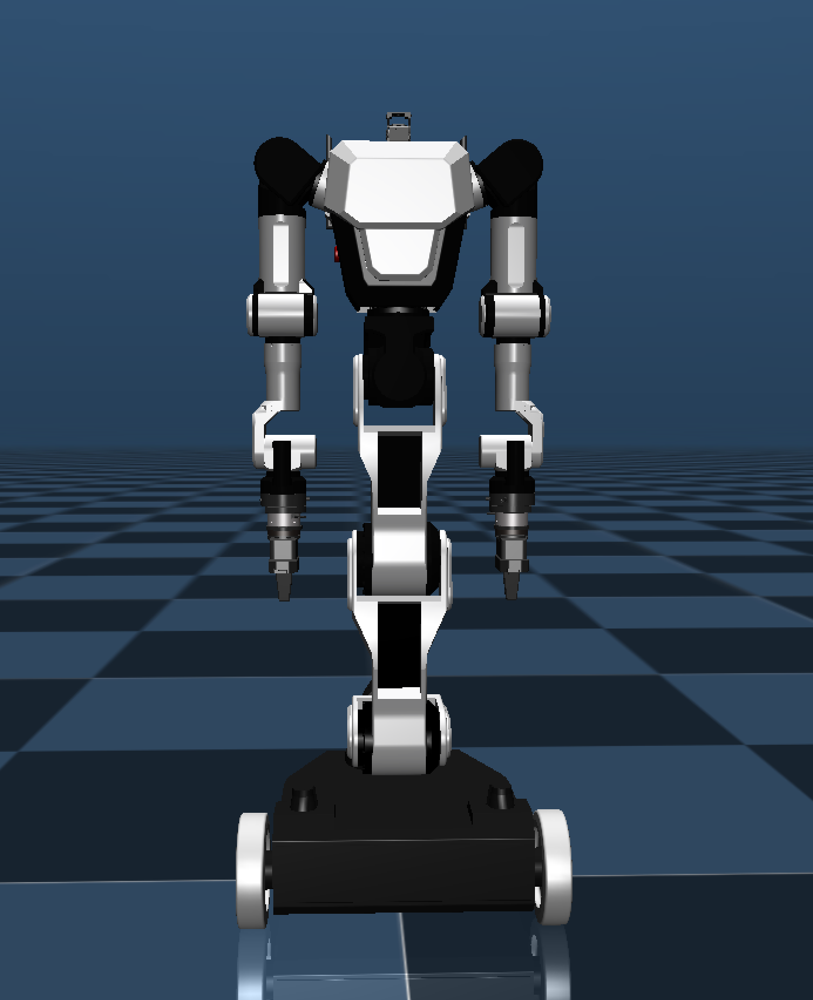

# Rainbow Robotics RBY1 Description (MJCF)

## Overview

This package contains a simplified robot description (MJCF) of the [RBY1](https://www.rainbowrobotics.com/rby1kor) developed by [Rainbow Robotics](https://www.rainbow-robotics.com/?_l=ko). It is derived from the [publicly
available MJCF description](https://github.com/RainbowRobotics).

<p float="left">
  
</p>

## MJCF derivation steps

**1. 3D Model / Mesh Preprocessing**
- For each part of the robot (body, joints, wheels, gripper, etc.), you can use tools like [`obj2mjcf`](https://github.com/kevinzakka/obj2mjcf) to convert *.obj or other 3D formats into MJCF if necessary.
- In this example, the meshes and assets.xml files have already been properly preprocessed.

**2. Basic MJCF Modifications**
- Review the MJCF file (either exported from MuJoCo or manually created) and adjust <default>, <actuator>, <joint>, etc., to match the robot’s structure.
- In RBY1's case:
  - `rby1.xml` 
    - defines the robot’s base structure (body, joints, mesh assets).
    - refines control ranges with position/velocity actuators.

**3. Free Joint and Collision Exclusion**
- To allow the robot to move freely in 3D, ensure a free joint (e.g., `world_j type="free"`) is added to the base. (In `rby1.xml`, `joint name="world_j" type="free"`)
- Prevent unwanted self-collisions by adding `<exclude>` statements or using `group` attributes and `class="in-model-collision"` to organize collision groups.
- This example uses `<default class="collision">` and `<default class="in-model-collision">` to reduce overhead and avoid undesired collisions.

## File Descriptions
- `rby1.xml`   
  Defines the robot’s main structure, mesh assets, joint tree, basic materials, and visualization settings.
  - Includes the base, wheels (`wheel_r`, `wheel_l`), torso links (`link_torso_*`), arms (`link_left_arm_*`, `link_right_arm_*`), head (`link_head_*`), and fingers (`ee_finger_*`).
  - Also contains a skybox texture, floor geometry, and lights under `<worldbody>`.


## Notes
- **Self-Collision**
  - RBY1 is configured to exclude certain internal collisions. If you need more or fewer collision checks, add or remove `<exclude>` elements or adjust `<geom group="">`.

- **Actuator Ranges**
  - In `rby1.xml`, you can modify `<position>` or `<velocity>` actuators’ `ctrlrange` to set joint angle/speed limits.

- **Home Keyframe**
  - A `<keyframe>` block can be added if you need a standard initial pose.


## License
This model is released under a [Apache License 2.0](LICENSE.txt).


## Publications

If you use this model in your work, please use the following citation:

```bibtex
@software{RBY1_2024,
    title = {RBY1: Dual-Arm Mobile Manipulator
    url = {https://rainbowrobotics.github.io/rby1-dev/},
    author = {RBY1 Team},
    year = {2024},
}
```