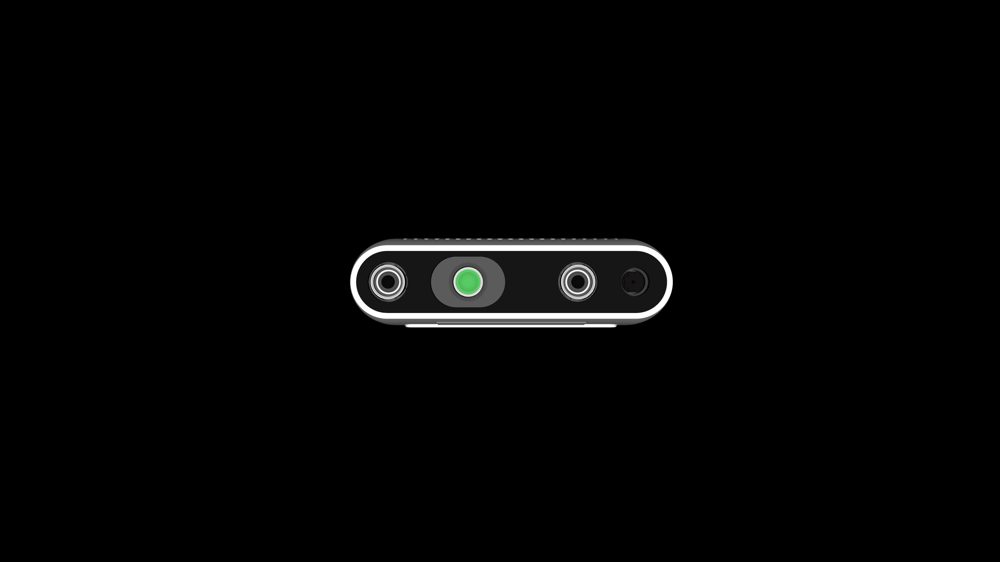

# Realsense D435i Description (MJCF)

Requires MuJoCo 2.2.2 or later.

## Overview

This package contains a simplified robot description (MJCF) of the [Realsense
D435i](https://www.intelrealsense.com/depth-camera-d435i/) camera developed by
Intel. It is derived from the [publicly
available](https://github.com/IntelRealSense/realsense-ros/blob/ros2-development/realsense2_description/urdf/_d435i.urdf.xacro)
URDF description with modifications by [Binit
Shah](https://www.linkedin.com/in/binit-shah) to include colors.

  

## URDF → MJCF derivation steps

1. Imported the camera mesh from the [URDF description](https://github.com/IntelRealSense/realsense-ros/blob/ros2-development/realsense2_description/meshes/d435.dae) into Blender and assigned colors.
2. Exported the mesh as a composite OBJ file.
3. Processed `.obj` files with  [`obj2mjcf`](https://github.com/kevinzakka/obj2mjcf).

## License

This model is released under an [Apache-2.0 License](LICENSE).
